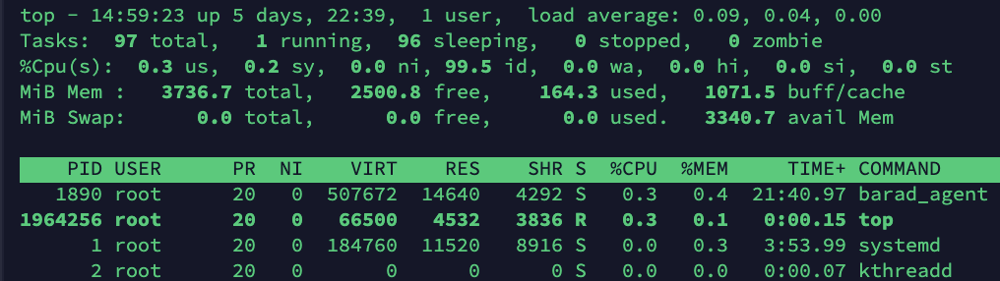

<!-- Advance Command -->



`xargs`是给命令传递参数的一个过滤器，可以将管道或标准输入（stdin）数据转换成命令行参数，也能够从文件的输出中读取数据，一般是和管道一起使用。
格式:
```shell
somecommand | xargs [-item] [command]
```
选项：
```shell
-a file 从文件中读入作为 stdin
-e flag ，注意有的时候可能会是-E，flag必须是一个以空格分隔的标志，当xargs分析到含有flag这个标志的时候就停止。
-p 当每次执行一个argument的时候询问一次用户。
-n num 后面加次数，表示命令在执行的时候一次用的argument的个数，默认是用所有的。
-t 表示先打印命令，然后再执行。
-i 或者是-I，这得看linux支持了，将xargs的每项名称，一般是一行一行赋值给 {}，可以用 {} 代替。
-r no-run-if-empty 当xargs的输入为空的时候则停止xargs，不用再去执行了。
-s num 命令行的最大字符数，指的是 xargs 后面那个命令的最大命令行字符数。
-L num 从标准输入一次读取 num 行送给 command 命令。
-l 同 -L。
-d delim 分隔符，默认的xargs分隔符是回车，argument的分隔符是空格，这里修改的是xargs的分隔符。
-x exit的意思，主要是配合-s使用。。
```





// TODO 测试线上能否正常显示图片  


Linux `top`命令VIRT,RES,SHR,DATA的含义:

- `VIRT`:`virtual memory usage`虚拟内存
  - 进程“需要的”虚拟内存大小，包括进程使用的库、代码、数据等
  - 假如进程申请100m的内存，但实际只使用了10m，那么它会增长100m，而不是实际的使用量
- `RES`:`resident memory usage`常驻内存
  - 进程当前使用的内存大小，但不包括swap out
  - 包含其他进程的共享
  - 如果申请100m的内存，实际使用10m，它只增长10m，与`VIRT`相反
  - 关于库占用内存的情况，它只统计加载的库文件所占内存大小
- `SHR`:`shared memory`共享内存
  - 除了自身进程的共享内存，也包括其他进程的共享内存
  - 虽然进程只使用了几个共享库的函数，但它包含了整个共享库的大小
  - 计算某个进程所占的物理内存大小公式：`RES – SHR`
  - `swap out`后，它将会降下来

`top`运行中可以通过`top`的内部命令对进程的显示方式进行控制。内部命令如下：  
s – 改变画面更新频率  
l – 关闭或开启第一部分第一行 top 信息的表示  
t – 关闭或开启第一部分第二行 Tasks 和第三行 Cpus 信息的表示  
m – 关闭或开启第一部分第四行 Mem 和 第五行 Swap 信息的表示  
N – 以 PID 的大小的顺序排列表示进程列表  
P – 以 CPU 占用率大小的顺序排列进程列表  
M – 以内存占用率大小的顺序排列进程列表  
h – 显示帮助  
n – 设置在进程列表所显示进程的数量  
q – 退出 top  

序号 列名 含义  
a PID 进程id  
b PPID 父进程id  
c RUSER Real user name  
d UID 进程所有者的用户id  
e USER 进程所有者的用户名  
f GROUP 进程所有者的组名  
g TTY 启动进程的终端名。不是从终端启动的进程则显示为 ?  
h PR 优先级  
i NI nice值。负值表示高优先级，正值表示低优先级  
j P 最后使用的CPU，仅在多CPU环境下有意义  
k %CPU 上次更新到现在的CPU时间占用百分比  
l TIME 进程使用的CPU时间总计，单位秒  
m TIME+ 进程使用的CPU时间总计，单位1/100秒  
n %MEM 进程使用的物理内存百分比  
o VIRT 进程使用的虚拟内存总量，单位kb。VIRT=SWAP+RES  
p SWAP 进程使用的虚拟内存中，被换出的大小，单位kb。  
q RES 进程使用的、未被换出的物理内存大小，单位kb。RES=CODE+DATA  
r CODE 可执行代码占用的物理内存大小，单位kb  
s DATA 可执行代码以外的部分(数据段+栈)占用的物理内存大小，单位kb  
t SHR 共享内存大小，单位kb  
u nFLT 页面错误次数  
v nDRT 最后一次写入到现在，被修改过的页面数。  
w S 进程状态。（D=不可中断的睡眠状态，R=运行，S=睡眠，T=跟踪/停止，Z=僵尸进程）  
x COMMAND 命令名/命令行  
y WCHAN 若该进程在睡眠，则显示睡眠中的系统函数名  
z Flags 任务标志，参考 sched.h

默认情况下仅显示比较重要的 PID、USER、PR、NI、VIRT、RES、SHR、S、%CPU、%MEM、TIME+、COMMAND 列。可以通过下面的快捷键来更改显示内容。  
通过`f`键可以选择显示的内容。按`f`键之后会显示列的列表，按`a-z`即可显示或隐藏对应的列，最后按回车键确定。
按`o`键可以改变列的显示顺序。按小写的`a-z`可以将相应的列向右移动，而大写的`A-Z`可以将相应的列向左移动。最后按回车键确定。
按大写的`F`或`O`键，然后按`a-z`可以将进程按照相应的列进行排序。而大写的`R`键可以将当前的排序倒转。



