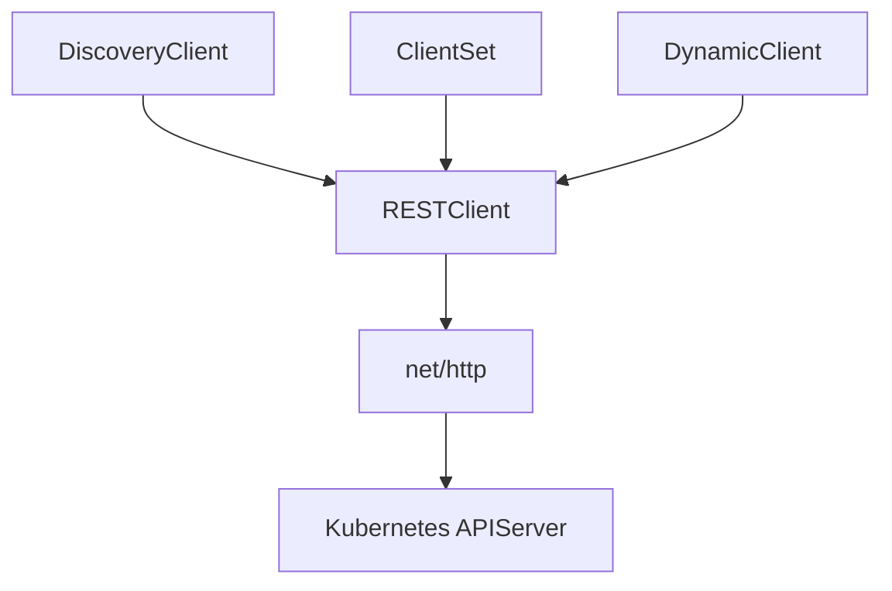

# client-go

#k8s #kubernetes #clientgo #apiserver #go #golang 

## 基础使用

###  [源码仓库](https://github.com/kubernetes/client-go)

### 依赖引入

```shell
go get k8s.io/client-go@latest

go get k8s.io/client-go@v0.20.4
```


## client-go 客户端

### 架构


[图片来源](https://github.com/kubernetes/sample-controller/blob/master/docs/controller-client-go.md)

#### 客户端组件

- `Reflector`：反射器，定义在 [type _Reflector_ inside package _cache_](https://github.com/kubernetes/client-go/blob/master/tools/cache/reflector.go) 中，监视 `Kubernetes API` 的指定资源类型（种类）。完成此操作的函数是 `ListAndWatch`。监视可以用于内置资源，也可以用于自定义资源。当 `Reflector` 通过 `watch API` 接收到关于新资源实例存在的通知时，它使用相应的 `listing API` 获取新创建的对象并将其放入 `watchHandler` 函数内的 `Delta Fifo` 队列中。
- `Informer`：在 [base controller inside package _cache_](https://github.com/kubernetes/client-go/blob/master/tools/cache/controller.go) 中定义的 `Informer` 从 ` Delta Fifo` 队列中弹出对象。完成此操作的函数是 `processLoop`。这个基本控制器的工作是保存对象供以后检索，并调用我们的控制器将对象传递给它。
- `Indexer`：索引器提供对象的索引功能。在 [type _Indexer_ inside package _cache_](https://github.com/kubernetes/client-go/blob/master/tools/cache/index.go) 中定义。一个典型的索引用例是基于对象标签创建索引。`Indexer` 可以维护基于多个索引函数的索引。索引器使用线程安全的数据存储来存储对象及其键。[type _Store_ inside package _cache_](https://github.com/kubernetes/client-go/blob/master/tools/cache/store.go) 中定义了一个名为 `MetaNamespaceKeyFunc` 的默认函数，它生成 `<namespace>/<name>` 的键作为该对象的组合。

#### 自定义控制器组件

- `Informer reference`：这是对知道如何使用自定义资源对象的 Informer 实例的引用。自定义控制器代码需要创建适当的 `Informer`。
- `Indexer reference`：这是对知道如何使用自定义资源对象的 `Indexer` 实例的引用。自定义控制器代码需要创建它。将使用此引用来检索对象以供以后处理。

> `client-go` 中的 `base controller` 提供了 `NewIndexerInformer` 函数来创建 `Informer` 和 `Indexer`。在代码中，可以[直接调用此函数](https://github.com/kubernetes/client-go/blob/master/examples/workqueue/main.go#L174)或[使用工厂方法来创建`Informer`](https://github.com/kubernetes/sample-controller/blob/master/main.go#L61)。

- `Resource Event Handlers`：这些是回调函数，当 `Informer` 想要将对象传递给控制器时将调用这些回调函数。编写这些函数的典型模式是获取分派对象的键并将该键放入工作队列中以供进一步处理。
- `Work queue:`：这是在控制器代码中创建的队列，用于将对象的传递与其处理分离。编写资源事件处理程序函数以提取已交付对象的键并将其添加到工作队列中。
- `Process Item`：这是在代码中创建的函数，用于处理工作队列中的项目。可以有一个或多个其他函数进行实际处理。这些函数通常会使用 [Indexer reference](https://github.com/kubernetes/client-go/blob/master/examples/workqueue/main.go#L73) 或 `Listing wrapper` 来检索与键对应的对象。

### 组件

`client-go` 共提供了 4 种与 `Kubernetes APIServer` 交互的客户端。分别是 `RESTClient`、`DiscoveryClient`、`ClientSet`、`DynamicClient`。

- `RESTClient`：最基础的客户端，主要是对 `HTTP` 请求进行了封装，支持 `Json` 和 `Protobuf` 格式的数据。
- `DiscoveryClient`：发现客户端，负责发现 `APIServer` 支持的资源组、资源版本和资源信息的。
- `ClientSet`：负责操作 `Kubernetes` 内置的资源对象，例如：`Pod`、`Service`等。
- `DynamicClient`：动态客户端，可以对任意的 `Kubernetes` 资源对象进行通用操作，包括 `CRD`。





