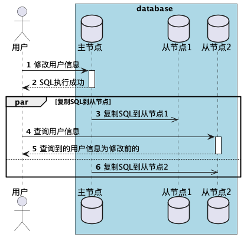
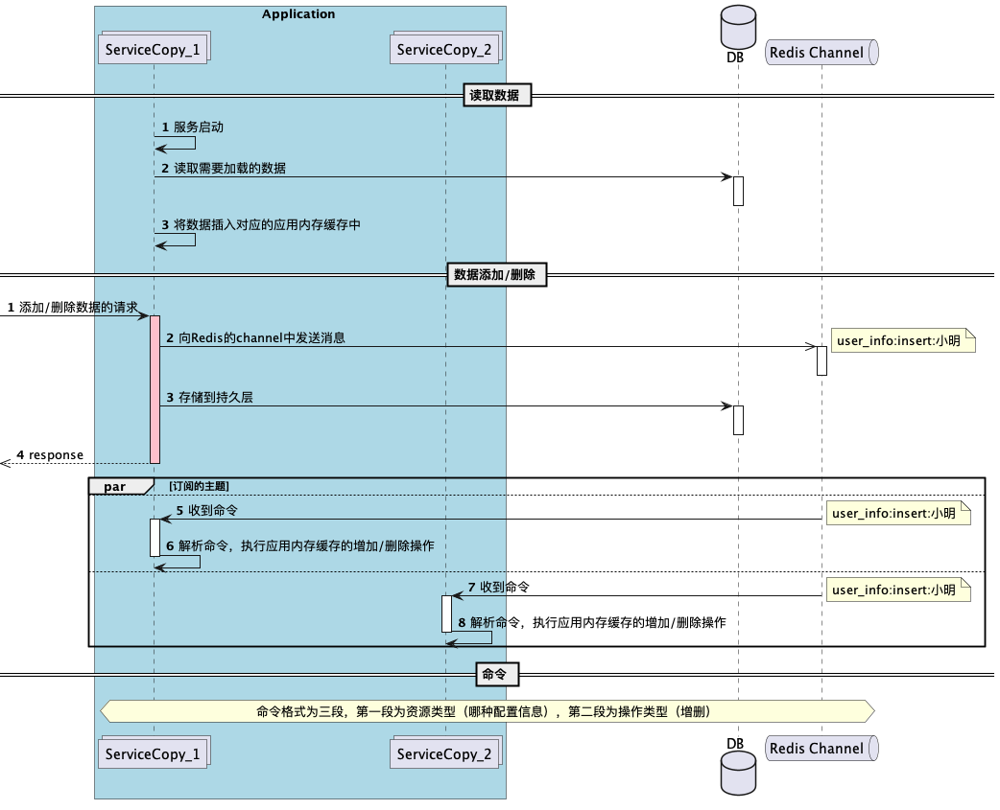

---

#golang

---

> 通常在生产中存储结构化数据最常用的是`MySQL`，而`MySQL`底层存储用的数据结构是B+树。当并发量达到一定程度之后通常会将单点的`MySQL`拆分成主从架构（在这之前可以加入内存型缓存如Redis等，属于不同层级的解决办法，不在此文讨论范畴）。

## 问题产生

在主从架构中主要问题之一有复制滞后。

这里以MySQL集群为例，主从复制要求所有写请求都经由主节点，而从节点只接收只读的查询请求（这一点在ES/Kafka的多副本分片中也有类似体现，主分片写入，从分片只支持读取）。对于读操作密集的负载（如web），这是一个不错的选择。

在这种扩展体系下，只需增加更多的从节点，就可以提高读请求的吞吐量。但是，这种方法在实际生产中只能用于异步复制，如果试图同步所有的从副本（即强一致性），则单个副本的写入失败将使数据在整个集群中写入失败。并且节点越多，发生故障的概率越高，所以以完全同步来设计系统在现实中反而非常不可靠。

> 在Kafka集群中为了提高消息吞吐量时与副本同步相关的设置通常会将`acks`设置为1或者0（1/0的区别在于leader是否落盘），partition的leader收到数据后即代表集群收到消息

说回到`MySQL`的主从集群，从上文中得到的结论，如果采用异步复制的话，很不幸如果一个应用正好从一个异步的从节点中读取数据，而该副本落后于主节点，这时应用读到的是过期的消息，表现在用户面前就会产生*薛定谔的数据*，即在同一时刻查询会出现两种截然不同的数据。

不过这个不一致的状态只是暂时的，经过一段时间之后，从节点的数据会更新到与主节点保持一致，即`最终一致性`。

## 解决办法

> 由于网络等原因导致的不一致性，不仅仅是存在于理论中，其是个实实在在的现实问题。下面分析复制滞后可能出现的问题，并找出相应的解决思路。

### 读自己的写

举个栗子：

当用户提交一些数据，然后刷新页面查看刚刚修改的内容时，例如用户信息，或者是对于一些帖子的评论等。提交新数据必须发送到主节点，但是当用户取数据时，数据可能来自从节点。

当集群是异步复制时就会出现问题，用户在数据写入到主节点而尚未达到从节点时刷新页面，看到的是数据修改之前的状态。这将给用户带来困惑。延伸到一些库存类型的应用，其实并不会导致超卖。如果用户看到是旧状态，误认为操作失败重新走了一遍流程，这时写入请求依然是访问到主节点，而主节点的数据是最新的，会返回失败。而这将进一步给用户带来困扰。

对于这种情况，我们需要"写后读一致性"，该机制保证用户重新加载页面，总是能看到自己最新更新的数据。**但对于其他用户看这条信息没有任何保证**



#### 方案一

总是从主节点读取用户可能会修改的信息，否则在从节点读取。即，从用户访问自己的信息时候从主节点读取，访问其他人的信息时候在从节点读取。

#### 方案二

在客户端记住最近更新的时间戳，并附带在请求中。如果查到的数据*不够新*，则从其他副本中重新查询，或者直接从主节点中查询。

#### 方案三

如果副本分布在多个数据中心（地理位置上的多个机房）等，就必须把请求路由到主节点所在的数据中心。*至少目前还没有接触过这种项目，没有很深的理解，不过多讨论这种情况。*

> 此外，依然存在一些其他问题需要考虑，如用户在多个设备上登录，这样一个设备就无法知道其他设备上进行了什么操作，如果采用方案二的话，依然会出现不一致。

### 单调读

> 在上述第二个例子中，出现了用户数据向后回滚的情况。


假设用户从不同副本进行了多次读取，用户刷新了一个网页，该请求可能会被随机路由到某一个从节点。用户2345先后在两个从节点上执行了两次完全相同的查询（先是少量滞后的从节点，然后是滞后很大的从节点），则很有可能出现以下情况。

第一个查询返回了最近用户1234所添加的评论，但第二个查询结果代表了更早时间点的状态。如果第一个查询没有返回任何内容，用户2345并不知道用户1234最近的评论，情况还好。但当用户2345看到了用户1234的评论之后，紧接着评论又消失了，就会感到十分困惑。

> 阿b(bilibili)的评论系统在使用中出现过类型的现象，但不清楚是否是由于审核等一些其他因素造成的。总之是在一个新视频发布后去刷新评论，第一次看到有人评论了，再次刷新评论又消失了。

单调读一致性可以确保不会发生这种异常。这是一个比强一致性弱，但比最终一致性强的保证。即保证用户依次进行多次读取，绝不会看到回滚的现象。

实现单调读的一种方式是，确保每个用户总是从固定的同一副本执行读操作（不同的用户当然可以从不同的副本读取）。例如，使用用户ID的哈希来决定去哪个副本读取消息，但如果该副本失效，系统必须要有能力将查询重新路由到其他有效的副本上。

### 前缀一致读

第三个由于复制滞后导致反常的例子。

比如A和B之间以下的对话：

```shell
A： 请问B，你能听到吗？
B： 你好A，我能听到
```

这两句话之间存在因果关系，即B听到了A的问题，然后再去回答。

现在如果有第三人在通过从节点上收听上述对话。假设B发的消息先同步了，观察者看到的对话就变成了这样：

```shell
B： 你好A，我能听到
A： 请问B，你能听到吗？
```

这逻辑就变得混乱了。

防止这种异常需要引入另一种保证：前缀一致读。该保证是说，对于一系列按照某个顺序发生的写请求，那么读取这些内容时必须要按照当时写入的顺序

## 小结

上面讨论的是在保证最终一致性异步复制的情况下发生的。当系统决不能忍受这些问题时，那就必须采用强一致性，但随之而来的就是写入性能低下，故障率高，一个节点故障引发整个集群不可用等各种问题。都需要在应用开始进行得失的平衡。

再举个栗子：

- 在kafka这种对写入性能要求极高的应用中，如果发送的消息不是特别重要，有要求极高吞吐量的时候，比如日志收集等，则可以设置为`Leader`收到消息即代表成功
- 而在`ES`中，则必须要求数据分片的所有副本都写入成功才返回成功，采用了强一致性。而`ES`采用了健康检查，超过1分钟不活跃的节点就剔除集群等机制，从而保证了数据可以实时地写入。

## 延伸

结合到实际工作中的项目分析，也存在类似问题。

下面举两个类似的栗子：

### 例一

在某基础信息管理平台中需要一个模糊搜索的功能，各方面平衡之后采用在应用内存中使用前缀树的方式做缓存。由于应用是多实例的，这时数据的增删改就会在多实例之间存在一个短暂的不一致。

### 例二

在某数据处理应用中，由于每一条数据中需要有多个（一到十几不等）条目访问缓存。开始的时候将缓存放在`Redis`里，而应用访问`Redis`的时间大概需要十几到几十毫秒的时间，这样每一条数据的处理时间就在几十毫秒到几百毫秒之间。而使用多线程处理，则会造成消息的严重乱序。

测试下来，程序每秒只能处理不超过20条数据，大大影响了效率。而后将缓存改到内存中，省掉了访问`Redis`的时间，再结合`Kafka`的一些优化策略，极大的提高了应用吞吐量。测试后每秒大概可以处理几千条数据。缓存放到程序内存中之后，也同样会出现缓存不一致的问题。

下面是这两个应用中采用的一个缓存架构图：



**在这个架构中，如果某个实例接收Redis消息慢了，就会出现不同实例间的数据不一致**

## 参考链接

《数据密集型应用系统设计》