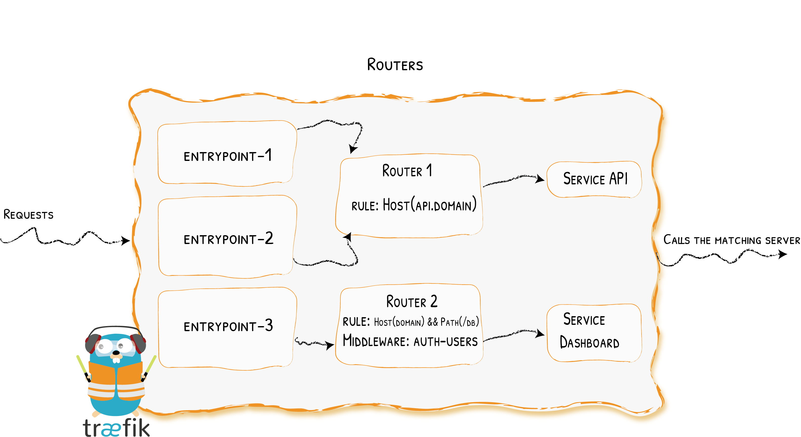

> Traefik is an open-source Edge Router that makes publishing your services a fun and easy experience. It receives requests on behalf of your system and finds out which components are responsible for handling them.
> What sets Traefik apart, besides its many features, is that it automatically discovers the right configuration for your services. The magic happens when Traefik inspects your infrastructure, where it finds relevant information and discovers which service serves which request.
> Traefik is natively compliant with every major cluster technology, such as Kubernetes, Docker, Docker Swarm, AWS, Mesos, Marathon, and the list goes on; and can handle many at the same time. (It even works for legacy software running on bare metal.)
> With Traefik, there is no need to maintain and synchronize a separate configuration file: everything happens automatically, in real time (no restarts, no connection interruptions). With Traefik, you spend time developing and deploying new features to your system, not on configuring and maintaining its working state.
> Developing Traefik, our main goal is to make it simple to use, and we're sure you'll enjoy it.
> 
> -- The Traefik Maintainer Team

## 程序下载

由于Traefik是由Golang语言所编写，程序是二进制包的形式。直接到Traefik在GitHub仓库的releases中下载即可。

我使用的是基于x86的64位Linux系统，所以在这里选择的是linux_amd64版本的包

```shell
wget https://github.com/traefik/traefik/releases/download/v2.5.3/traefik_v2.5.3_linux_amd64.tar.gz
```

解压得到程序

```shell
tar -zxvf traefik_v2.5.3_linux_amd64.tar.gz
```

将程序重命名为`traefik`并放到`/usr/local/bin/`目录下

## 静态配置

> 静态配置是Traefik在程序启动的时候从配置文件、环境变量或启动参数中加载到内存中的配置参数。如果需要修改，则需要重启Traefik。

[静态配置的官方文档](https://doc.traefik.io/traefik/getting-started/configuration-overview/#configuration-file)

根据文档介绍，Traefik会从以下几个目录读取名为`traefik.yml`（或`traefik.yaml`或`traefik.toml`）的静态配置文件：

- `/etc/traefik/`
- `$XDG_CONFIG_HOME/`
- `$HOME/.config/`
- `.`(Traefik程序运行的当前目录)

或者在启动的时候以参数形式指定静态配置文件：

```shell
traefik --configFile=foo/bar/myconfigfile.yml
```

### 代理端口


使用`entryPoints`向外暴露端口

```yaml
entryPoints:
  web:
    address: ":80"
  websecure:
    address: ":443"
```

### 添加动态配置

Traefik支持动态配置，即配置修改后Traefik可以自动重新加载，我在这里选择了从文件读取动态配置，通过`providers`添加动态配置的配置文件的路径或文件名，在这里我使用了目录的形式（`dictory`和`filename`二选一）。

这里也可以修改动态配置的重新加载间隔时间，默认是`2S`，我在这里使用了默认配置，不做修改。

```yaml
providers:
  file:
    directory: /etc/traefik/dynamic-conf
    watch: true
```

### 开启API

在这里可以开启Traefik的dashboard以及api

```yaml
api:
  insecure: true
```

dashboard默认使用的是`8080`端口，如果要修改，则需要在`entryPoints`下添加名为`traefik`的端口配置：

```yaml
entryPoints:
  traefik:
    address: ":10000"
```

### 程序日志

Traefik支持将程序运行的日志输出到文件，通过`log`标签可以设置日志输出文件，输出格式以及日志级别。

```yaml
log:
  filePath: /etc/traefik/traefik.log
  format: json
  level: ERROR
```

### 访问日志

Traefik支持将访问日志输出到文件，通过`accessLog`配置

```yaml
accessLog:
  filePath: /etc/traefik/access.log
  format: json
```

### 监控

`// TODO`

```yaml
metrics:
  prometheus:
    addRoutersLabels: true
    entryPoint: metrics
```

## 动态配置

> 动态配置中存储的是路由、服务、中间件等配置信息，是可以在程序运行时动态修改的值。

以下是Traefik所支持的动态配置提供者：

|Provider|Type|Configuration Type|Provider Name|
|---|---|---|---|
|Docker|Orchestrator|Label|docker|
|Kubernetes IngressRoute|Orchestrator|Custom Resource|kubernetescrd|
|Kubernetes Ingress|Orchestrator|Ingress|kubernetes|
|Kubernetes Gateway API|Orchestrator|Gateway API Resource|kubernetesgateway|
|Consul Catalog|Orchestrator|Label|consulcatalog|
|ECS|Orchestrator|Label|ecs|
|Marathon|Orchestrator|Label|marathon|
|Rancher|Orchestrator|Label|rancher|
|File|Manual|YAML/TOML format|file|
|Consul|KV|KV|consul|
|Etcd|KV|KV|etcd|
|ZooKeeper|KV|KV|zookeeper|
|Redis|KV|KV|redis|
|HTTP|Manual|JSON format|http|

---

> 我在这里选择了`File`类型的提供者，以下均为`File`类型的介绍

### 路由



路由类型分为三种，分别为：`http`、`tcp`、`udp`

在这里我使用的是`HTTP`的路由功能：

```yaml
http:
  routers:
    router-traefik:
      rule: HostRegexp(`traefik.{domain:.*}`)
      service: traefik
    router-grafana:
      rule: HostRegexp(`grafana.{domain:.*}`)
      service: grafana
```

> `service`指向的是下面定义的Service的名称

#### 路由规则

路由规则是指，Traefik接收到的请求，根据给定规则路由到不同的服务中。

Traefik一共支持以下规则：

|Rule|Description|
|---|---|
|Headers(\`key\`, \`value\`)|Check if there is a key keydefined in the headers, with the value value|
|HeadersRegexp(\`key\`, \`regexp\`)|Check if there is a key keydefined in the headers, with a value that matches the regular expression regexp|
|Host(\`example.com\`, ...)|Check if the request domain (host header value) targets one of the given domains.|
|HostHeader(\`example.com\`, ...)|Check if the request domain (host header value) targets one of the given domains.|
|HostRegexp(\`example.com\`, \`{subdomain:[a-z]+}.example.com\`, ...)|Check if the request domain matches the given regexp.|
|Method(\`GET\`, ...)|Check if the request method is one of the given methods (GET, POST, PUT, DELETE, PATCH, HEAD)|
|Path(\`/path\`, \`/articles/{cat:[a-z]+}/{id:[0-9]+}\`, ...)|Match exact request path. It accepts a sequence of literal and regular expression paths.|
|PathPrefix(\`/products/\`, \`/articles/{cat:[a-z]+}/{id:[0-9]+}\`)|Match request prefix path. It accepts a sequence of literal and regular expression prefix paths.|
|Query(\`foo=bar\`, \`bar=baz\`)|Match Query String parameters. It accepts a sequence of key=value pairs.|
|ClientIP(\`10.0.0.0/16\`, \`::1\`)|Match if the request client IP is one of the given IP/CIDR. It accepts IPv4, IPv6 and CIDR formats|

---

我这这里主要会用到`HostRegexp`和`PathPrefix`，即对请求url的两种使用正则的过滤规则，前者用于匹配二级域名，后者用于将不同路径的请求转发至不同服务。

> 这个正则配起来稍微有点小坑，哈哈。我研究了好久才搞明白要怎么写。

为了对`Host`和`Path`使用正则表达式，需要声明一个任意命名的变量，然后跟上用冒号分隔的正则表达式，所有这些都用花括号括起来。

_示例：HostRegexp(\`grafana.{domain:.*}\`)_

### 服务


服务负责配置如何到达实际的服务，最终将处理传入的请求。使用`service`定义：

```yaml
http:
  services:
    traefik:
      loadBalancer:
        servers:
          - url: "http://127.0.0.1:10000"
```

我们将上面开启的Traefik的监控面板作为服务封装了起来，只要路由到`traefik`这个服务上，即可访问监控面板。

在这里也可以实现负载均衡等功能，可以参照[官网介绍](https://doc.traefik.io/traefik/routing/services/)

## 开机启动

> 有了上次部署Nginx的经验，这里我们完全采用`Systemd`来管理。即，使用`systemctl`命令来管理服务。

### 原理

Systemd默认从目录`/etc/systemd/system/`读取配置文件。但是，里面存放的大部分文件都是符号链接，指向目录`/usr/lib/systemd/system/`，真正的配置文件存放在那个目录

`systemctl enable`命令用于在上面两个目录之间，建立符号链接关系。

```shell
systemctl enable traefik.service
# 等同于
ln -s '/usr/lib/systemd/system/traefik.service' '/etc/systemd/system/multi-user.target.wants/traefik.service'
```

### Unit配置文件

下面是Traefik源码仓库中给出的[`traefik.service`](https://github.com/traefik/traefik/blob/master/contrib/systemd/traefik.service) 示例，其中有几个需要注意的点：

- `Type`：程序启动方式
- `ExecStart`：程序运行的命令，在这里直接指向程序本身
- `WatchdogSec`：程序检测时间

```shell
[Unit]
Description=Traefik
Documentation=https://doc.traefik.io/traefik/
#After=network-online.target
#AssertFileIsExecutable=/usr/bin/traefik
#AssertPathExists=/etc/traefik/traefik.toml

[Service]
# Run traefik as its own user (create new user with: useradd -r -s /bin/false -U -M traefik)
#User=traefik
#AmbientCapabilities=CAP_NET_BIND_SERVICE

# configure service behavior
Type=notify
#ExecStart=/usr/bin/traefik --configFile=/etc/traefik/traefik.toml
Restart=always
WatchdogSec=1s

# lock down system access
# prohibit any operating system and configuration modification
#ProtectSystem=strict
# create separate, new (and empty) /tmp and /var/tmp filesystems
#PrivateTmp=true
# make /home directories inaccessible
#ProtectHome=true
# turns off access to physical devices (/dev/...)
#PrivateDevices=true
# make kernel settings (procfs and sysfs) read-only
#ProtectKernelTunables=true
# make cgroups /sys/fs/cgroup read-only
#ProtectControlGroups=true

# allow writing of acme.json
#ReadWritePaths=/etc/traefik/acme.json
# depending on log and entrypoint configuration, you may need to allow writing to other paths, too

# limit number of processes in this unit
#LimitNPROC=1

[Install]
WantedBy=multi-user.target
```

###  作为服务开启

```shell
systemctil start traefik.service
```

### 设置开机启动

```shell
systemctil enable traefik.service
```

### 查看运行状态

```shell
systemctil status traefik.service
```

## 文件汇总

```shell
root
├─ etc
│	└─ traefik
│	 	├─ access.log           // 访问日志
│	 	├─ dynamic_conf         // 动态配置存放文件夹
│	 	│	└─ dynamic_conf.yml // 动态配置文件
│	 	├─ traefik.log          // 程序日志
│	 	└─ traefik.yml          // 静态配置文件
└─ usr
 	└─ local
 	 	└─ bin
 	 	 	└─ traefik          // 程序本身
```

### 静态配置

```yaml
## Static configuration
entryPoints:
  web:
    address: ":80"
  websecure:
    address: ":443"
  traefik:
    address: ":10000"
  metrics:
    address: ":8082"

# 动态配置的配置
providers:
  file:
    directory: /etc/traefik/dynamic-conf
    watch: true

# API
api:
  insecure: true

# 运行日志
log:
  filePath: /etc/traefik/traefik.log
  format: json
  level: ERROR

# 访问日志
accessLog:
  filePath: /etc/traefik/access.log
  format: json

# 监控
metrics:
  prometheus:
    addRoutersLabels: true
    entryPoint: metrics
```

### 动态配置

```yaml
## Dynamic configuration
http:
  routers:
    router-traefik:
      rule: HostRegexp(`traefik.{domain:.*}`)
      service: traefik
    router-grafana:
      rule: HostRegexp(`grafana.{domain:.*}`)
      service: grafana
    router-prometheus:
      rule: HostRegexp(`prometheus.{domain:.*}`)
      service: prometheus

  services:
    traefik:
      loadBalancer:
        servers:
          - url: "http://127.0.0.1:10000"
    grafana:
      loadBalancer:
        servers:
          - url: "http://127.0.0.1:3000"
    prometheus:
      loadBalancer:
        servers:
          - url: "http://127.0.0.1:9090"
```

## 参考链接

- [Traefik源码仓库](https://github.com/traefik/traefik)
- [Traefik官网](https://traefik.io)
- [Traefik静态配置项-File provider](https://doc.traefik.io/traefik/reference/static-configuration/file/)
- [Systemd文档](https://www.freedesktop.org/software/systemd/man/systemd.unit.html)

