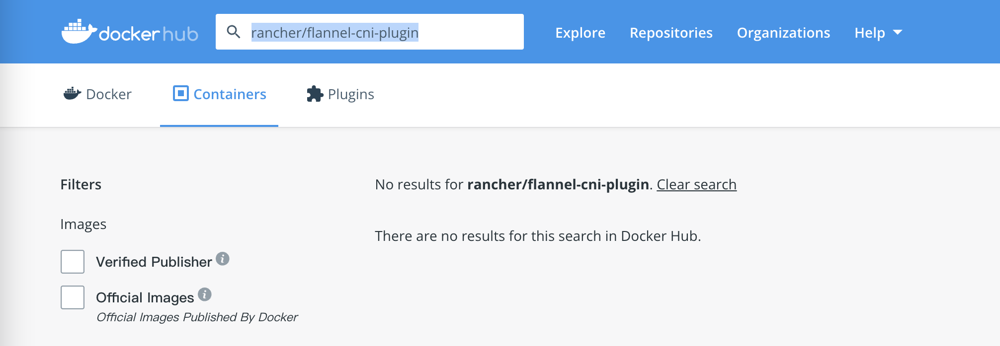
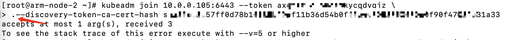
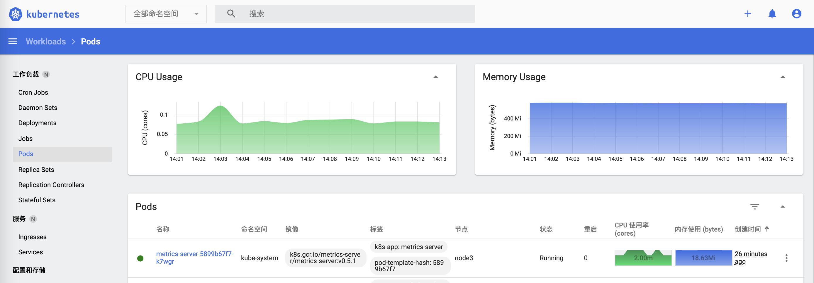

> 此次安装的平台是基于ARM架构的RedHat系Linux系统平台，参照[Kubernetes官方文档](https://kubernetes.io/)进行的。  
> 本文档流程与X86架构的没有区别，官方文档中个别步骤中的命令需要区分所使用的包对应的平台。

## 初始化环境

### 防火墙

```shell
systemctl stop firewalld.service
systemctl disable firewalld.service
```

### SELinux

```shell
vi /etc/selinux/config
```

```shell
SELINUX=disabled
```

### Swap

```shell
vi /etc/fstab
```

注释掉`swap`这一行

```shell
/.swapfile	none	swap	sw,comment=cloudconfig	0	0
```

重启之后查看关闭是否成功

```shell
free -m
```

显示如下内容，`swap`关闭成功

```shell
              total        used        free      shared  buff/cache   available
Mem:          23114         402       22299          32         411       20597
Swap:             0           0           0
```

### ulimit

```shell
echo "ulimit -n 65535" >> /etc/profile
echo "*	hard	nofile	65535" >> /etc/security/limits.conf
```

重启之后检查是否配置成功

```shell
ulimit -n
```

## SSH免密（非必须）

执行命令，一路回车，即可获得当前节点的公钥

```shell
ssh-keygen -t rsa
cat id_rsa.pub
```

## iptables

查看`br_netfilter`模块是否开启

```shell
lsmod | grep br_netfilter
```

如果没有看到输出则执行命令开启

```shell
modprobe br_netfilter
```

作为Linux节点的iptables正确查看桥接流量的要求，应该确保`net.bridge.bridge-nf-call-iptables`在`sysctl`配置中设置为`1`

```shell
cat <<EOF | sudo tee /etc/modules-load.d/k8s.conf
br_netfilter
EOF

cat <<EOF | sudo tee /etc/sysctl.d/k8s.conf
net.bridge.bridge-nf-call-ip6tables = 1
net.bridge.bridge-nf-call-iptables = 1
EOF
sudo sysctl --system
```

## 安装Docker

```shell
yum install -y yum-utils
```

```shell
yum-config-manager \
    --add-repo \
    https://download.docker.com/linux/centos/docker-ce.repo
```

```shell
yum install docker-ce docker-ce-cli containerd.io -y
```

```shell
systemctl start docker
systemctl enable docker
```

修改Docker Cgroup Driver 为 systemd（大坑一）

```shell
vi /usr/lib/systemd/system/docker.service
```

修改配置文件中的启动参数

```shell
#ExecStart=/usr/bin/dockerd -H fd:// --containerd=/run/containerd/containerd.sock
ExecStart=/usr/bin/dockerd -H fd:// --containerd=/run/containerd/containerd.sock --exec-opt native.cgroupdriver=systemd
```

重启Docker

```shell
systemctl daemon-reload
systemctl restart docker
```

## 安装Kubernetes

- `kubeadm`：引导集群的命令。
- `kubelet`：在集群中的所有机器上运行的组件，并执行诸如启动`Pod`和容器之类的操作。
- `kubectl`：用于与集群通信的命令行实用程序

使用`yum`安装，添加`yum`源

```shell
cat <<EOF | sudo tee /etc/yum.repos.d/kubernetes.repo
[kubernetes]
name=Kubernetes
baseurl=https://packages.cloud.google.com/yum/repos/kubernetes-el7-\$basearch
enabled=1
gpgcheck=1
repo_gpgcheck=1
gpgkey=https://packages.cloud.google.com/yum/doc/yum-key.gpg https://packages.cloud.google.com/yum/doc/rpm-package-key.gpg
exclude=kubelet kubeadm kubectl
EOF
```

安装并启动

```shell
yum install -y kubelet kubeadm kubectl --disableexcludes=kubernetes
systemctl enable --now kubelet
```

至此，集群中所有节点都是相同操作

## 初始化master

使用`kubeadm`作为集群的初始化工具

```shell
kubeadm init --kubernetes-version=v1.22.2 --pod-network-cidr=10.244.0.0/16
```

成功初始化之后会出现提示，其中有三个需要手动执行，最后一个是需要在从节点上执行（此处有坑）

```shell
Your Kubernetes control-plane has initialized successfully!

To start using your cluster, you need to run the following as a regular user:

  mkdir -p $HOME/.kube
  sudo cp -i /etc/kubernetes/admin.conf $HOME/.kube/config
  sudo chown $(id -u):$(id -g) $HOME/.kube/config

Alternatively, if you are the root user, you can run:

  export KUBECONFIG=/etc/kubernetes/admin.conf

You should now deploy a pod network to the cluster.
Run "kubectl apply -f [podnetwork].yaml" with one of the options listed at:
  https://kubernetes.io/docs/concepts/cluster-administration/addons/

Then you can join any number of worker nodes by running the following on each as root:

kubeadm join --control-plane 10.0.0.105:6443 --token axqrzz.ouonxxxxxxgdvgjz \
	--discovery-token-ca-cert-hash sha256:3a57ff0d78b1f85xxxxxxxxxxxxxxxxxxxxe0f90f47037a31a33 
```

手动执行

```shell
mkdir -p #HOME/.kube
sudo cp -i /etc/kubernetes/admin.conf #HOME/.kube/config
sudo chown #(id -u):#(id -g) #HOME/.kube/config

kubeadm join --control-plane 10.0.0.105:6443 --token axqrzz.ouonxxxxxxgdvgjz \
	--discovery-token-ca-cert-hash sha256:3a57ff0d78b1f85xxxxxxxxxxxxxxxxxxxxe0f90f47037a31a33
```

使用`kubectl get nodes`命令查看节点

```shell
NAME         STATUS    ROLES                  AGE    VERSION
arm-node-1   NotReady  control-plane,master   1m     v1.22.2
```

此时可以看到`master`处于`NotReady`状态

查看集群中`pod`状态

> 这是后期补的，所以时间很久

```shell
kubectl get pod --all-namespaces

# 输出
NAMESPACE     NAME                                 READY   STATUS    RESTARTS       AGE
kube-system   coredns-78fcd69978-2vcqt             1/1     Pending   1 (126m ago)   12h
kube-system   coredns-78fcd69978-xg98g             1/1     Pending   1 (126m ago)   12h
kube-system   etcd-arm-node-1                      1/1     Running   2 (126m ago)   12h
kube-system   kube-apiserver-arm-node-1            1/1     Running   2 (126m ago)   12h
kube-system   kube-controller-manager-arm-node-1   1/1     Running   2 (126m ago)   12h
kube-system   kube-proxy-q5m5k                     1/1     Running   1 (126m ago)   12h
kube-system   kube-scheduler-arm-node-1            1/1     Running   2 (126m ago)   12h
```

可以看到两个`coredns`的`pod`处于`Pending`状态，这是由于缺少网络组件  
这里我们选择安装`flannel`

大坑二

```shell
kubectl apply -f https://raw.githubusercontent.com/flannel-io/flannel/master/Documentation/kube-flannel.yml
```

执行这条命令之后查看pod状态会出现`ErrImagePull`的提示  
原因是`rancher/flannel-cni-plugin:v1.2`的镜像拉取不到  
到网上查了一番，看好多是相同的报错，但是因为`quay.io/coreos/flannel`的镜像拉不到，于是我手动拉了一下`rancher/flannel-cni-plugin`这个镜像

```shell
docker pull rancher/flannel-cni-plugin:v1.2
# 输出
Error response from daemon: pull access denied for rancher/flannel-cni-plugin, repository does not exist or may require 'docker login': denied: requested access to the resource is denied
```

咦？找不到镜像？
于是我去Docker Hub的页面去搜了一下，居然没有这个镜像



~~真是啥坑都有~~

去[flannel-io/flannel的issue](https://github.com/flannel-io/flannel/issues/1482)中看了一下，最新的一条就是这个相同的问题

好吧，删掉换个旧版本重新来过

在GitHub的`flannel-io/flannel`仓库中切到`v0.14.1`版本中看了一下，没有使用到`rancher/flannel-cni-plugin`这个镜像

```shell
kubectl delete -f https://raw.githubusercontent.com/flannel-io/flannel/master/Documentation/kube-flannel.yml
kubectl apply -f https://raw.githubusercontent.com/flannel-io/flannel/release/v0.14.1/Documentation/kube-flannel.yml
```

这回成功了，重新查看`pod`和节点状态

```shell
kubectl get pod --all-namespaces

# 输出
NAMESPACE     NAME                                 READY   STATUS    RESTARTS       AGE
kube-system   coredns-78fcd69978-2vcqt             1/1     Running   1 (126m ago)   12h
kube-system   coredns-78fcd69978-xg98g             1/1     Running   1 (126m ago)   12h
kube-system   etcd-arm-node-1                      1/1     Running   2 (126m ago)   12h
kube-system   kube-apiserver-arm-node-1            1/1     Running   2 (126m ago)   12h
kube-system   kube-controller-manager-arm-node-1   1/1     Running   2 (126m ago)   12h
kube-system   kube-flannel-ds-kdpgp                1/1     Running   1 (126m ago)   3h32m
kube-system   kube-proxy-q5m5k                     1/1     Running   1 (126m ago)   12h
kube-system   kube-scheduler-arm-node-1            1/1     Running   2 (126m ago)   12h
```

```shell
kubectl get nodes

# 输出
NAME         STATUS   ROLES                  AGE    VERSION
arm-node-1   Ready    control-plane,master   13h    v1.22.2
```

## 初始化从节点（大坑三）

对于从节点，安装完`kubeadm`，`kubelet`，`kebectl`三个组件后，直接运行`master`节点`kubeadm init`完成之后的输出结果中的最后一条命令

```shell
kubeadm join --control-plane 10.0.0.105:6443 --token axqrzz.ouonxxxxxxgdvgjz \
	--discovery-token-ca-cert-hash sha256:3a57ff0d78b1f85xxxxxxxxxxxxxxxxxxxxe0f90f47037a31a33
```

但是这里我踩到一个坑，复制的这条命令粘贴到命令行中后，在第二行开头会莫名其妙多出来一个`.`



造成执行`kubeadm join`时一直报参数数量的错误

```shell
accepts at most 1 arg(s), received 3
To see the stack trace of this error execute with --v=5 or higher
```

_这个问题也查了好久，最后将命令改为一行去执行_

```shell
kubeadm join --control-plane 10.0.0.105:6443 --token axqrzz.ouonxxxxxxgdvgjz --discovery-token-ca-cert-hash sha256:3a57ff0d78b1f85xxxxxxxxxxxxxxxxxxxxe0f90f47037a31a33
```

命令执行返回加入集群成功后查看节点状态

```shell
kubectl get nodes

# 输出
NAME         STATUS   ROLES                  AGE    VERSION
arm-node-1   Ready    control-plane,master   13h    v1.22.2
arm-node-2   Ready    <none>                 170m   v1.22.2
```

可以看到从节点成功加入主节点

## 安装Dashboard

### 安装服务

```shell
kubectl -n kubernetes-dashboard get secret $(kubectl -n kubernetes-dashboard get sa/admin-user -o jsonpath="{.secrets[0].name}") -o go-template="{{.data.token | base64decode}}"
```

### 创建权限及用户

```yaml
apiVersion: v1
kind: ServiceAccount
metadata:
  name: admin-user
  namespace: kubernetes-dashboard
```

```yaml
apiVersion: rbac.authorization.k8s.io/v1
kind: ClusterRoleBinding
metadata:
  name: admin-user
roleRef:
  apiGroup: rbac.authorization.k8s.io
  kind: ClusterRole
  name: cluster-admin
subjects:
- kind: ServiceAccount
  name: admin-user
  namespace: kubernetes-dashboard
```

### 获取Token

```shell
kubectl -n kubernetes-dashboard get secret $(kubectl -n kubernetes-dashboard get sa/admin-user -o jsonpath="{.secrets[0].name}") -o go-template="{{.data.token | base64decode}}"
```

## 安装Metrics Server

- `Kubernetes Metrics Server`是Cluster的核心监控数据的聚合器，`kubeadm`默认是不部署的。
- `Metrics Server`供`Dashboard`等其他组件使用，是一个扩展的`APIServer`，依赖于`API Aggregator`。
- `Metrics API`只可以查询当前的度量数据，并不保存历史数据。
- `Metrics API URI`为`/apis/metrics.k8s.io/`，在`k8s.io/metrics`下维护。
- 必须部署`metrics-server`才能使用该`API`，`metrics-server`通过调用`kubelet Summary API`获取数据。

### 修改API Server

检查`API Server`是否开启了`Aggregator Routing`：查看`API Server`是否具有`--enable-aggregator-routing=true`选项。

```shell
ps -ef | grep apiserver | grep routing
```

如果没有输出，直接修改`/etc/kubernetes/manifests/kube-apiserver.yaml`

```shell
vi /etc/kubernetes/manifests/kube-apiserver.yaml
```

修改每个`API Server`的`kube-apiserver.yaml`

> 修改`manifests`配置后`API Server`会自动重启生效

```yaml
# ...省略
spec:
  containers:
  - command:
    - kube-apiserver
    - --enable-aggregator-routing=true  # 加入这一行
# ...省略
```

### 部署到k8s

从GitHub上下载的部署文件需要修改一下

```yaml
# ...省略
spec:
  selector:
    matchLabels:
      k8s-app: metrics-server
  strategy:
    rollingUpdate:
      maxUnavailable: 0
  template:
    metadata:
      labels:
        k8s-app: metrics-server
    spec:
      containers:
      - args:
        - --cert-dir=/tmp
        - --secure-port=443
        - --kubelet-preferred-address-types=InternalIP  # 删掉 ExternalIP,Hostname这两个
        - --kubelet-use-node-status-port
        - --kubelet-insecure-tls  # 加上该启动参数
        image: k8s.gcr.io/metrics-server/metrics-server:v0.5.1  # 镜像版本自己选择
# ...省略
```

_完整部署文件见附录_

### 验证安装工

1. 使用命令查看节点负载

```shell
kubectl top nodes

# 输出
NAME    CPU(cores)   CPU%   MEMORY(bytes)   MEMORY%   
node1   117m         5%     1959Mi          25%       
node2   29m          2%     1640Mi          21%       
node3   43m          4%     1694Mi          22% 
```

2. 到Dashboard查看资源占用情况



## 参考链接

- [k8s官网](https://kubernetes.io/)
- [kubectl开启shell自动补全](https://kubernetes.io/zh/docs/tasks/tools/install-kubectl-linux/#enable-shell-autocompletion)
- [k8s dashboard repository](https://github.com/kubernetes/dashboard)
- [k8s metrics-server repository](https://github.com/kubernetes-sigs/metrics-server)
- [Docker 文档](https://docs.docker.com/)
- [Docker Hub](https://hub.docker.com/)
- [flannel GitHub](https://github.com/flannel-io/flannel)
- [v0.14.1 kube-flannel.yml](https://raw.githubusercontent.com/flannel-io/flannel/release/v0.14.1/Documentation/kube-flannel.yml)

## 附录

### v0.14.1/kube-flannel.yml

```yaml
# v0.14.1/kube-flannel.yml
---
apiVersion: policy/v1beta1
kind: PodSecurityPolicy
metadata:
  name: psp.flannel.unprivileged
  annotations:
    seccomp.security.alpha.kubernetes.io/allowedProfileNames: docker/default
    seccomp.security.alpha.kubernetes.io/defaultProfileName: docker/default
    apparmor.security.beta.kubernetes.io/allowedProfileNames: runtime/default
    apparmor.security.beta.kubernetes.io/defaultProfileName: runtime/default
spec:
  privileged: false
  volumes:
  - configMap
  - secret
  - emptyDir
  - hostPath
  allowedHostPaths:
  - pathPrefix: "/etc/cni/net.d"
  - pathPrefix: "/etc/kube-flannel"
  - pathPrefix: "/run/flannel"
  readOnlyRootFilesystem: false
  # Users and groups
  runAsUser:
    rule: RunAsAny
  supplementalGroups:
    rule: RunAsAny
  fsGroup:
    rule: RunAsAny
  # Privilege Escalation
  allowPrivilegeEscalation: false
  defaultAllowPrivilegeEscalation: false
  # Capabilities
  allowedCapabilities: ['NET_ADMIN', 'NET_RAW']
  defaultAddCapabilities: []
  requiredDropCapabilities: []
  # Host namespaces
  hostPID: false
  hostIPC: false
  hostNetwork: true
  hostPorts:
  - min: 0
    max: 65535
  # SELinux
  seLinux:
    # SELinux is unused in CaaSP
    rule: 'RunAsAny'
---
kind: ClusterRole
apiVersion: rbac.authorization.k8s.io/v1
metadata:
  name: flannel
rules:
- apiGroups: ['extensions']
  resources: ['podsecuritypolicies']
  verbs: ['use']
  resourceNames: ['psp.flannel.unprivileged']
- apiGroups:
  - ""
  resources:
  - pods
  verbs:
  - get
- apiGroups:
  - ""
  resources:
  - nodes
  verbs:
  - list
  - watch
- apiGroups:
  - ""
  resources:
  - nodes/status
  verbs:
  - patch
---
kind: ClusterRoleBinding
apiVersion: rbac.authorization.k8s.io/v1
metadata:
  name: flannel
roleRef:
  apiGroup: rbac.authorization.k8s.io
  kind: ClusterRole
  name: flannel
subjects:
- kind: ServiceAccount
  name: flannel
  namespace: kube-system
---
apiVersion: v1
kind: ServiceAccount
metadata:
  name: flannel
  namespace: kube-system
---
kind: ConfigMap
apiVersion: v1
metadata:
  name: kube-flannel-cfg
  namespace: kube-system
  labels:
    tier: node
    app: flannel
data:
  cni-conf.json: |
    {
      "name": "cbr0",
      "cniVersion": "0.3.1",
      "plugins": [
        {
          "type": "flannel",
          "delegate": {
            "hairpinMode": true,
            "isDefaultGateway": true
          }
        },
        {
          "type": "portmap",
          "capabilities": {
            "portMappings": true
          }
        }
      ]
    }
  net-conf.json: |
    {
      "Network": "10.244.0.0/16",
      "Backend": {
        "Type": "vxlan"
      }
    }
---
apiVersion: apps/v1
kind: DaemonSet
metadata:
  name: kube-flannel-ds
  namespace: kube-system
  labels:
    tier: node
    app: flannel
spec:
  selector:
    matchLabels:
      app: flannel
  template:
    metadata:
      labels:
        tier: node
        app: flannel
    spec:
      affinity:
        nodeAffinity:
          requiredDuringSchedulingIgnoredDuringExecution:
            nodeSelectorTerms:
            - matchExpressions:
              - key: kubernetes.io/os
                operator: In
                values:
                - linux
      hostNetwork: true
      priorityClassName: system-node-critical
      tolerations:
      - operator: Exists
        effect: NoSchedule
      serviceAccountName: flannel
      initContainers:
      - name: install-cni
        image: quay.io/coreos/flannel:v0.14.0
        command:
        - cp
        args:
        - -f
        - /etc/kube-flannel/cni-conf.json
        - /etc/cni/net.d/10-flannel.conflist
        volumeMounts:
        - name: cni
          mountPath: /etc/cni/net.d
        - name: flannel-cfg
          mountPath: /etc/kube-flannel/
      containers:
      - name: kube-flannel
        image: quay.io/coreos/flannel:v0.14.0
        command:
        - /opt/bin/flanneld
        args:
        - --ip-masq
        - --kube-subnet-mgr
        resources:
          requests:
            cpu: "100m"
            memory: "50Mi"
          limits:
            cpu: "100m"
            memory: "50Mi"
        securityContext:
          privileged: false
          capabilities:
            add: ["NET_ADMIN", "NET_RAW"]
        env:
        - name: POD_NAME
          valueFrom:
            fieldRef:
              fieldPath: metadata.name
        - name: POD_NAMESPACE
          valueFrom:
            fieldRef:
              fieldPath: metadata.namespace
        volumeMounts:
        - name: run
          mountPath: /run/flannel
        - name: flannel-cfg
          mountPath: /etc/kube-flannel/
      volumes:
      - name: run
        hostPath:
          path: /run/flannel
      - name: cni
        hostPath:
          path: /etc/cni/net.d
      - name: flannel-cfg
        configMap:
          name: kube-flannel-cfg
```

### v0.5.1/metrics-server.yml

```yaml
# v0.5.1/metrics-server.yml
apiVersion: v1
kind: ServiceAccount
metadata:
  labels:
    k8s-app: metrics-server
  name: metrics-server
  namespace: kube-system
---
apiVersion: rbac.authorization.k8s.io/v1
kind: ClusterRole
metadata:
  labels:
    k8s-app: metrics-server
    rbac.authorization.k8s.io/aggregate-to-admin: "true"
    rbac.authorization.k8s.io/aggregate-to-edit: "true"
    rbac.authorization.k8s.io/aggregate-to-view: "true"
  name: system:aggregated-metrics-reader
rules:
  - apiGroups:
      - metrics.k8s.io
    resources:
      - pods
      - nodes
    verbs:
      - get
      - list
      - watch
---
apiVersion: rbac.authorization.k8s.io/v1
kind: ClusterRole
metadata:
  labels:
    k8s-app: metrics-server
  name: system:metrics-server
rules:
  - apiGroups:
      - ""
    resources:
      - pods
      - nodes
      - nodes/stats
      - namespaces
      - configmaps
    verbs:
      - get
      - list
      - watch
---
apiVersion: rbac.authorization.k8s.io/v1
kind: RoleBinding
metadata:
  labels:
    k8s-app: metrics-server
  name: metrics-server-auth-reader
  namespace: kube-system
roleRef:
  apiGroup: rbac.authorization.k8s.io
  kind: Role
  name: extension-apiserver-authentication-reader
subjects:
  - kind: ServiceAccount
    name: metrics-server
    namespace: kube-system
---
apiVersion: rbac.authorization.k8s.io/v1
kind: ClusterRoleBinding
metadata:
  labels:
    k8s-app: metrics-server
  name: metrics-server:system:auth-delegator
roleRef:
  apiGroup: rbac.authorization.k8s.io
  kind: ClusterRole
  name: system:auth-delegator
subjects:
  - kind: ServiceAccount
    name: metrics-server
    namespace: kube-system
---
apiVersion: rbac.authorization.k8s.io/v1
kind: ClusterRoleBinding
metadata:
  labels:
    k8s-app: metrics-server
  name: system:metrics-server
roleRef:
  apiGroup: rbac.authorization.k8s.io
  kind: ClusterRole
  name: system:metrics-server
subjects:
  - kind: ServiceAccount
    name: metrics-server
    namespace: kube-system
---
apiVersion: v1
kind: Service
metadata:
  labels:
    k8s-app: metrics-server
  name: metrics-server
  namespace: kube-system
spec:
  ports:
    - name: https
      port: 443
      protocol: TCP
      targetPort: https
  selector:
    k8s-app: metrics-server
---
apiVersion: apps/v1
kind: Deployment
metadata:
  labels:
    k8s-app: metrics-server
  name: metrics-server
  namespace: kube-system
spec:
  replicas: 1
  selector:
    matchLabels:
      k8s-app: metrics-server
  strategy:
    rollingUpdate:
      maxUnavailable: 0
  template:
    metadata:
      labels:
        k8s-app: metrics-server
    spec:
      containers:
        - args:
            - --cert-dir=/tmp
            - --secure-port=443
            - --kubelet-insecure-tls
            - --kubelet-preferred-address-types=InternalIP
            - --kubelet-use-node-status-port
            - --metric-resolution=15s
          image: k8s.gcr.io/metrics-server/metrics-server:v0.5.1
          imagePullPolicy: IfNotPresent
          livenessProbe:
            failureThreshold: 3
            httpGet:
              path: /livez
              port: https
              scheme: HTTPS
            periodSeconds: 10
          name: metrics-server
          ports:
            - containerPort: 443
              name: https
              protocol: TCP
          readinessProbe:
            failureThreshold: 3
            httpGet:
              path: /readyz
              port: https
              scheme: HTTPS
            initialDelaySeconds: 20
            periodSeconds: 10
          resources:
            requests:
              cpu: 100m
              memory: 200Mi
          securityContext:
            readOnlyRootFilesystem: true
            runAsNonRoot: true
            runAsUser: 1000
          volumeMounts:
            - mountPath: /tmp
              name: tmp-dir
      nodeSelector:
        kubernetes.io/os: linux
      priorityClassName: system-cluster-critical
      serviceAccountName: metrics-server
      volumes:
        - emptyDir: {}
          name: tmp-dir
---
apiVersion: apiregistration.k8s.io/v1
kind: APIService
metadata:
  labels:
    k8s-app: metrics-server
  name: v1beta1.metrics.k8s.io
spec:
  group: metrics.k8s.io
  groupPriorityMinimum: 100
  insecureSkipTLSVerify: true
  service:
    name: metrics-server
    namespace: kube-system
  version: v1beta1
  versionPriority: 100
```

