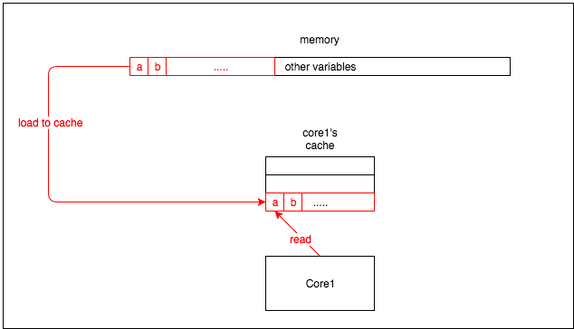
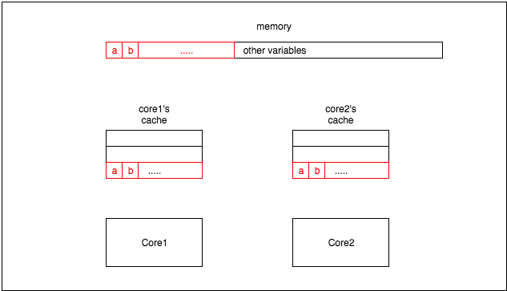
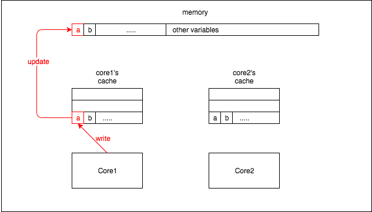
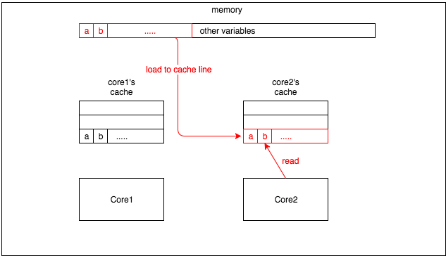

---

#golang #cache_line

---

> 开发中不可避免地会遇到需要对全局变量加锁的情况，而一旦并发量高了之后，加锁的变量有可能变成服务的性能瓶颈所在。所以千方百计地寻找优化方法。

## 改变锁的类型

如果业务中的全局变量是读多写少的应用场景，我们可以将互斥锁改为读写锁。即读取时对变量加读锁，这样可以支持多个线程并发读取同一个变量。而只有变量需要修改时才加写锁，保证写的时候不会被其他线程读取到错误的值。

互斥锁：

```go
func DoWork() {
	lock.Lock()
	defer lock.Unlock()
	// do something...
}
```

读写锁：
```go
func Read() {
	lock.RLock()
	defer lock.RUnlock()
	// read global variable
}

func Write() {
	lock.Lock()
	defer lock.Unlock()
	// write global variable
}
```

## 降低锁住的代码块长度

在`Go`中，我们常常会利用`defer`关键字的特性，写出如下的代码：

```go
func Write() {
	lock.Lock()
	defer lock.Unlock()
	// do something...
}
```

但在实际代码中，如果对全局变量读写前后会有较长时间去做其他工作的情况下，就会造成极大的性能损耗。加锁之后没有立即对全局变量进行读写，或者对全局变量读写完之后没有立即释放锁，都会使其他线程没有办法立即抢到锁，从而拉低了整个系统的并发性能。

根据这个逻辑，可以将上述代码改成如下格式：

```go
func Write() {
	// do something...

	lock.Lock()
	// read or write global variable
	lock.Unlock()

	// do something...
}
```

但至此，也还是简单的从代码执行流程上进行了一个简单的优化。

## 对数据切片

除了修改锁的类型以及修改'锁住'的代码块长度，我们还可以通过一些其他方式降低锁的粒度。

假设我们的全局变量是一个`map`，我们可以对`key`做一个哈希后取模的操作，将原来一个`map`的数据分开写到多个`map`中。这样同一个大集合中的数据便支持了同时对多个数据进行写入而互不影响。

> 取模是为了将key分到不同数据分片上，而取模之前的哈写操作是为了将不同的`key`均分到所有数据分片上。诚然，热点`key`（同一个`key`）还是会到同一个数据分片上。

我们可以参考(Prometheus源码)[https://github.com/prometheus/prometheus/blob/6e3a0efe40918f72edfc89bc150bc0ece1a8c46f/tsdb/head.go#L1333] 中的写法，写出如下简化版代码：

```go
package main

import "sync"

const (
	defaultStripSize = 1 << 16
	defaultStripMask = defaultStripSize - 1
)

type stripLock struct {
	sync.RWMutex
	_ [40]byte
}

type StripMap struct {
	locks   []stripLock
	buckets []map[uint64]interface{}
}

func DefaultStripMap() *StripMap {
	s := &StripMap{
		locks:   make([]stripLock, defaultStripSize),
		buckets: make([]map[uint64]interface{}, defaultStripSize),
	}

	for i := range s.buckets {
		s.buckets[i] = make(map[uint64]interface{})
	}

	return s
}

func (s *StripMap) Set(key uint64, value interface{}) {
	s.locks[key&defaultStripMask].RLock()
	defer s.locks[key&defaultStripMask].RUnlock()

	s.buckets[key&defaultStripMask][key] = value
}

func (s *StripMap) Get(key uint64) (interface{}, bool) {
	s.locks[key&defaultStripMask].RLock()
	defer s.locks[key&defaultStripMask].RUnlock()

	v, ok := s.buckets[key&defaultStripMask][key]
	return v, ok
}

func (s *StripMap) Remove(key uint64) {
	s.locks[key&defaultStripMask].Lock()
	defer s.locks[key&defaultStripMask].Unlock()

	delete(s.buckets[key&defaultStripMask], key)
}
```

在这个例子中只是简单的对`key`做了一个取模的操作，并没有进行哈希。如果实际业务中需要，可以采取先哈希再取模的操作。

在上述示例代码中，有两个点可以值得我们学习，下面进行逐一分析

### 使用位运算代替取模操作

> `a % b = a & (b-1)`当且仅当`b = 2^n`时成立

`b = 2 ^ n`可以写为`b = 1 << n`即1左移n位。

因而`b / a`即为b在二进制下向右移动n位，`b % a`就是a中被右移走的低n位。

`b - 1`即为`1 << n - 1`，二进制表示下即为n个1。

举个栗子：
```shell
假设n = 10
b = 2 ^ 10 = 1 << 10 = 10 000 000 000(二进制)
b - 1 = 2 ^ 10 - 1 = 1 << 10 - 1 = 1 111 111 111(二进制)
b - 1 的二进制表示即为n个1
```

因此`key`对`defaultStripSize`做取模操作即可写为`key&(defaultStripSize - 1)`

### Cache Line

在上面的示例代码中如果不了解的话可以看到一个很奇怪的结构：

```go
type stripLock struct {
	sync.RWMutex
	_ [40]byte
}
```

其中的`_ [40]byte`第一次看到的时候觉得十分的困惑，~~这样写不是白白浪费内存么~~。后来发现这个写法的作用是为了提高性能而采取的措施。

```go
type stripLock struct {
		sync.RWMutex
		_ [40]byte
	}
sl := stripLock{}
fmt.Println(unsafe.Sizeof(sl))
```

这段代码输出为：`64`

#### 名词解析

接下来我们大概了解一下CPU中缓存工作的机制：

CPU中缓存的最小单元是`cache line`，现在的处理器中的`cache line`通常都是64byte。因此当CPU从内存中读取数据时会读取该变量周围所有的东西。



> 也就是说core1要读取变量a的时候会将a临近的b一起加载到缓存中来。

如果同一个变量位于不同核心的`cache`中时，就会产生一些问题。



core1将变量a修改



core2读取变量b，这时即使b没有发生改变，也会因为在同一个`cache line`中其他值的改变而导致`cache line`丢失。所以core2会重新从内存中加载`cache line`中所有的变量。



> 这就是所谓的`假共享`：一个核心的更新会导致其他核心也更新缓存。

所以我们应尽量避免由于一个核心的修改导致其他核心重新从内存中读取数据，因为从内存中读取数据的效率要远远低于从缓存中读取数据。 

解决这个问题的办法通常是缓存填充：在变量之间填充一些无意义的变量，这将迫使一个变量单独一个核心的缓存行。这样当其他核心更新变量时，不会使该核心从内存中重新加载数据。

#### 验证

[这是一个Go写的benchmark](https://github.com/genchilu/concurrencyPractice/tree/master/golang/pad)

这里有个小小的花絮，由于我用的电脑是M1的CPU，而M1是基于`ARM`的架构。因此在这里呈现出了跟预期相反的测试结果：

> 问题原因是有些处理器比如`ARM`、`RISC-V`不允许未对齐的内存访问，不会产生跨`cache line`的原子访问，所以不会产生`split lock`，而 X86 是支持的。
> 
> 而我在同事的X86电脑上得出的测试结果则是跟预期相符的。

```shell
❯ go test -v -bench=. -benchmem -count=5

goos: darwinv -bench=. -benchmem -count=5
goarch: arm64
pkg: awesomeProject
BenchmarkNoPad
BenchmarkNoPad-8        1000000000               0.09975 ns/op         0 B/op          0 allocs/op
BenchmarkNoPad-8        1000000000               0.09889 ns/op         0 B/op          0 allocs/op
BenchmarkNoPad-8        1000000000               0.09750 ns/op         0 B/op          0 allocs/op
BenchmarkNoPad-8        1000000000               0.09979 ns/op         0 B/op          0 allocs/op
BenchmarkNoPad-8        1000000000               0.09916 ns/op         0 B/op          0 allocs/op
BenchmarkPad
BenchmarkPad-8          1000000000               0.1105 ns/op          0 B/op          0 allocs/op
BenchmarkPad-8          1000000000               0.1095 ns/op          0 B/op          0 allocs/op
BenchmarkPad-8          1000000000               0.1098 ns/op          0 B/op          0 allocs/op
BenchmarkPad-8          1000000000               0.1095 ns/op          0 B/op          0 allocs/op
BenchmarkPad-8          1000000000               0.1090 ns/op          0 B/op          0 allocs/op
PASS
ok      awesomeProject  10.660s
```

## 延伸

> 当我看到上文提到的缓存填充时，第一感觉跟内存对齐有点类似，这里就重新总结一下。

### 内存对齐

`Go`中数据类型占用内存空间大小可以参考：[链接](https://ormissia.github.io/notes/go/basic/basic/)

#### 对齐系数

在了解如何对齐之前,我们需要了解"对齐系数"这个概念,unsafe 标准库提供了`Alignof`方法,可以返回一个类型的对齐系数一般来说,对齐系数在我们常用的平台的系数如下:

- 32 位：4
- 64 位：8

#### 对齐规则

在了解完大小和对齐系数以后,我们就可以利用对齐规则对结构体进行内存对齐:

- 结构体的成员变量，第一个成员变量的偏移量为0。往后的每个成员变量的对齐值必须为编译器默认对齐长度（#pragma pack(n)）或当前成员变量类型的长度（unsafe.Sizeof），取最小值作为当前类型的对齐值。其偏移量必须为对齐值的整数倍
- 结构体本身，对齐值必须为编译器默认对齐长度（#pragma pack(n)）或结构体的所有成员变量类型中的最大长度，取最大数的最小整数倍作为对齐值
- 结合以上两点，可得知若编译器默认对齐长度（#pragma pack(n)）超过结构体内成员变量的类型最大长度时，默认对齐长度是没有任何意义的.

> 其中#pragma pack(n)的取值就是我们前面介绍的操作系统一般情况下的取值，即32位为4，64位为8.

#### 举个栗子

```go
type Ex struct {
	a bool
	d int32
	c int8
	b int64
	e byte
}
fmt.Println(unsafe.Sizeof(Ex{}))
```

以上代码输出结果为：`32`

根据对齐规则可知，内存布局如下：

```shell
axxx|bbbb|cxxx|xxxx|dddd|dddd|e…
```

但是由于整个结构体也需要对齐，可以得出，最终的内存布局为：

```shell
axxx|bbbb|cxxx|xxxx|dddd|dddd|exxx|xxxx
```

### 对比

- `cache line`是为了解决不同变量之在多个CPU核心之间共享的问题
- `内存对齐`是为了解决同一个结构体内部访问效率等问题

## 参考链接

- [prometheus源码示例](https://github.com/prometheus/prometheus/blob/6e3a0efe40918f72edfc89bc150bc0ece1a8c46f/tsdb/head.go#L1333)
- [What’s false sharing and how to solve it (using Golang as example)](https://medium.com/@genchilu/whats-false-sharing-and-how-to-solve-it-using-golang-as-example-ef978a305e10)
- [Golang和假共享(false sharing)](https://www.xwxwgo.com/post/2019/07/09/golang%E5%92%8Cfalse-sharing/)
- [Golang 内存对齐和伪共享False Sharing](https://www.wangt.cc/2021/11/golang-%E5%86%85%E5%AD%98%E5%AF%B9%E9%BD%90%E5%92%8C%E4%BC%AA%E5%85%B1%E4%BA%ABfalse-sharing/)
- [深入剖析 split locks，i++ 可能导致的灾难](https://www.shouxicto.com/article/3984.html)
