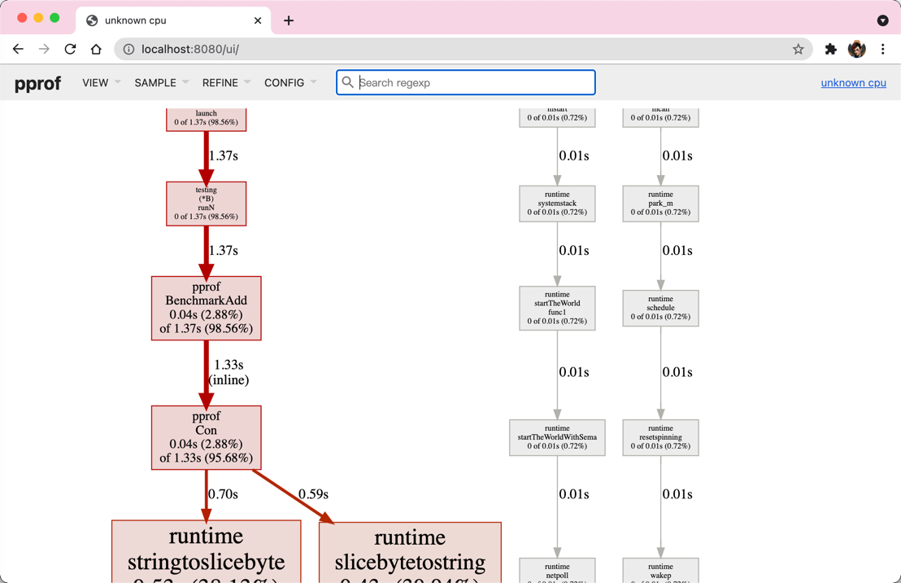

---


---

> pprof is a tool for visualization and analysis of profiling data.

> pprof reads a collection of profiling samples in profile.proto format and generates reports to visualize and 
> help analyze the data. It can generate both text and graphical reports (through the use of the dot visualization package).

> `PProf`是用于可视化和分析性能分析数据的工具，`PProf`以`profile.proto`读取分析样本的集合，并生成报告以可视化并帮助分析数据（支持文本和图形报告）。

## 简介

### 采集方式

- `runtime/pprof`：采集程序（非`Server`）的指定区块的运行数据进行分析。
- `net/http/pprof`：基于HTTPServer运行，并且可以采集运行时数据进行分析。
- `gotest`：通过运行测试用例，并指定所需标识来进行采集。

### 功能

- CPUProfiling：CPU分析，按照一定的频率采集所监听的应用程序CPU（含寄存器）的使用情况，可确定应用程序在主动消耗CPU周期时花费时间的位置。
- MemoryProfiling：内存分析，在应用程序进行堆分配时记录堆栈跟踪，用于监视当前和历史内存使用情况，以及检查内存泄漏。
- BlockProfiling：阻塞分析，记录`Goroutine`阻塞等待同步（包括定时器通道）的位置，默认不开启，需要调用`runtime.SetBlockProfileRate`进行设置。
- MutexProfiling：互斥锁分析，报告互斥锁的竞争情况，默认不开启，需要调用`runtime.SetMutexProfileFraction`进行设置。
- GoroutineProfiling：`Goroutine`分析，可以对当前应用程序正在运行的`Goroutine`进行堆栈跟踪和分析。这项功能在实际排查中会经常用到， 
  因为很多问题出现时的表象就是`Goroutine`暴增，而这时候我们要做的事情之一就是查看应用程序中的`Goroutine`正在做什么事情，因为什么阻塞了， 
  然后再进行下一步。

## 简单的例子

注意要在`import`中引入 `_ "net/http/pprof"`

```go
package main

import (
	"log"
	"net/http"
	_ "net/http/pprof"
	"time"
)

func main() {
	go func() {
		for {
			log.Println("pprof")
			time.Sleep(time.Second)
		}
	}()

	if err := http.ListenAndServe("0.0.0.0:6060", nil); err != nil {
		log.Println(err)
		return
	}
}
```

### 通过web页面访问

运行之后打开页面[http://127.0.0.1:6060/debug/pprof/](http://127.0.0.1:6060/debug/pprof/)

```go
/debug/pprof/

Types of profiles available:
Count	Profile
0	allocs
0	block
0	cmdline
5	goroutine
0	heap
0	mutex
0	profile
7	threadcreate
0	trace
full goroutine stack dump
Profile Descriptions:

allocs: A sampling of all past memory allocations
block: Stack traces that led to blocking on synchronization primitives
cmdline: The command line invocation of the current program
goroutine: Stack traces of all current goroutines
heap: A sampling of memory allocations of live objects. You can specify the gc GET parameter to run GC before taking the heap sample.
mutex: Stack traces of holders of contended mutexes
profile: CPU profile. You can specify the duration in the seconds GET parameter. After you get the profile file, use the go tool pprof command to investigate the profile.
threadcreate: Stack traces that led to the creation of new OS threads
trace: A trace of execution of the current program. You can specify the duration in the seconds GET parameter. After you get the trace file, use the go tool trace command to investigate the trace.
```

### 通过终端访问

```bash
go tool pprof http://localhost:6060/debug/pprof/profile\?seconds\=60
```

执行该命令后，需等待60秒（可调整`seconds`的值），`pprof`会进行`CPU Profiling`。结束后将默认进入`pprof`的交互式命令模式，
可以对分析的结果进行查看或导出。

```bash
Fetching profile over HTTP from http://localhost:6060/debug/pprof/profile?seconds=60
Saved profile in /Users/orimissia/pprof/pprof.samples.cpu.003.pb.gz
Type: cpu
Time: Aug 6, 2021 at 2:41pm (CST)
Duration: 1mins, Total samples = 10ms (0.017%)
Entering interactive mode (type "help" for commands, "o" for options)
(pprof) 
```

具体可执行`pprof help`查看命令说明

```bash
(pprof) top10
Showing nodes accounting for 10ms, 100% of 10ms total
      flat  flat%   sum%        cum   cum%
      10ms   100%   100%       10ms   100%  runtime.kevent
         0     0%   100%       10ms   100%  runtime.findrunnable
         0     0%   100%       10ms   100%  runtime.mcall
         0     0%   100%       10ms   100%  runtime.netpoll
         0     0%   100%       10ms   100%  runtime.park_m
         0     0%   100%       10ms   100%  runtime.schedule
```

- flat：给定函数上运行耗时
- flat%：同上的CPU运行耗时总比例
- sum%：给定函数累积使用CPU总比例
- cum：当前函数加上它之上的调用运行总耗时
- cum%：同上的CPU运行耗时总比例

> 最后一列为函数名称，在大多数的情况下，我们可以通过这五列得出一个应用程序的运行情况，加以优化。

```bash
go tool pprof http://localhost:6060/debug/pprof/heap
```

```bash
Saved profile in /Users/orimissia/pprof/pprof.alloc_objects.alloc_space.inuse_objects.inuse_space.001.pb.gz
Type: inuse_space
Time: Aug 6, 2021 at 2:46pm (CST)
No samples were found with the default sample value type.
Try "sample_index" command to analyze different sample values.
Entering interactive mode (type "help" for commands, "o" for options)
```

- -inuse_space：分析应用程序的常驻内存占用情况
- -alloc_objects：分析应用程序的内存临时分配情况

### 可视化界面

新建测试用例：
```go
package main

import "testing"

const str = "ormissia"

func TestAdd(t *testing.T) {
	s := Con(str)
	if s == "" {
		t.Errorf("Test.Add error!")
	}
}

func BenchmarkAdd(b *testing.B) {
	for i := 0; i < b.N; i++ {
		Con(str)
	}
}

func Con(str string) string {
	data := []byte(str)
	sData := string(data)
	return sData
}
```

执行测试用例

```bash
% go test -bench=. -cpuprofile=cpu.prof
goos: darwin
goarch: arm64
pkg: awesomeProject/pprof
BenchmarkAdd-8          182690547                6.330 ns/op
PASS
ok      awesomeProject/pprof    2.366s
```

启动`pprof`可视化界面

方法一

```bash
go tool pprof -http=:8080 cpu.prof
```

方法二

```bash
go tool pprof cpu.prof 
(pprof) web
```

可视化界面



## 参考

- [https://github.com/google/pprof](https://github.com/google/pprof)
- [https://golang2.eddycjy.com/posts/ch6/01-pprof-1](https://golang2.eddycjy.com/posts/ch6/01-pprof-1/)
