---

#oauth

---

> `PKCE`全称是`Proof Key for Code Exchange`，在2015年发布，它是`OAuth 2.0`核心的一个扩展协议，所以可以和现有的授权模式结合使用，比如`Authorization Code`+`PKCE`， 这也是最佳实践，`PKCE`最初是为移动设备应用和本地应用创建的， 主要是为了减少公共客户端的授权码拦截攻击。
> 在最新的`OAuth 2.1`规范中，推荐所有客户端都使用`PKCE`，而不仅仅是公共客户端，并且移除了`Implicit`隐式和`Password`模式，那之前使用这两种模式的客户端怎么办? 是的，现在都可以尝试使用`Authorization Code`+`PKCE`的授权模式。那`PKCE`为什么有这种魔力呢? 实际上它的原理是客户端提供一个自创建的证明给授权服务器，授权服务器通过它来验证客户端，把访问令牌(`access_token`)颁发给真实的客户端而不是伪造的。

## 客户端类型

上面说到了`PKCE`主要是为了减少公共客户端的授权码拦截攻击，那就有必要介绍下两种客户端类型了。

> `OAuth 2.0`核心规范定义了两种客户端类型， `confidential` 机密的， 和 `public` 公开的， 区分这两种类型的方法是， 判断这个客户端是否有能力维护自己的机密性凭据 `client_secret`。

- confidential  
  对于一个普通的web站点来说，虽然用户可以访问到前端页面，但是数据都来自服务器的后端api服务，前端只是获取授权码`code`，通过`code`换取`access_token`这一步是在后端的api完成的，由于是内部的服务器，客户端有能力维护密码或者密钥信息，这种是机密的的客户端。
- public  
  客户端本身没有能力保存密钥信息，比如桌面软件，手机App，单页面程序(SPA)，因为这些应用是发布出去的，实际上也就没有安全可言，恶意攻击者可以通过反编译等手段查看到客户端的密钥，这种是公开的客户端。

在`OAuth 2.0`授权码模式（`Authorization Code`）中，客户端通过授权码code向授权服务器获取访问令牌(`access_token`)时，同时还需要在请求中携带客户端密钥(`client_secret`)，授权服务器对其进行验证，保证`access_token`颁发给了合法的客户端，对于公开的客户端来说，本身就有密钥泄露的风险，所以就不能使用常规`OAuth 2.0`的授权码模式，于是就针对这种不能使用`client_secret`的场景，衍生出了`Implicit`隐式模式，这种模式从一开始就是不安全的。在经过一段时间之后，`PKCE`扩展协议推出，就是为了解决公开客户端的授权安全问题。

## 授权码拦截攻击

上面是`OAuth 2.0`授权码模式的完整流程，授权码拦截攻击就是图中的`C`步骤发生的，也就是授权服务器返回给客户端授权码的时候，这么多步骤中为什么`C`步骤是不安全的呢?在`OAuth 2.0`核心规范中，要求授权服务器的`anthorize endpoint`和`token endpoint`必须使用`TLS`（安全传输层协议）保护，但是授权服务器携带授权码`code`返回到客户端的回调地址时，有可能不受`TLS`的保护，恶意程序就可以在这个过程中拦截授权码`code`，拿到`code`之后，接下来就是通过`code`向授权服务器换取访问令牌`access_token`，对于机密的客户端来说，请求`access_token`时需要携带客户端的密钥`client_secret`，而密钥保存在后端服务器上，所以恶意程序通过拦截拿到授权码`code`也没有用，而对于公开的客户端（手机App，桌面应用）来说，本身没有能力保护`client_secret`，因为可以通过反编译等手段，拿到客户端`client_secret`，也就可以通过授权码`code`换取`access_token`，到这一步，恶意应用就可以拿着`token`请求资源服务器了。

`state`参数，在`OAuth 2.0`核心协议中，通过`code`换取`token`步骤中，推荐使用`state`参数，把请求和响应关联起来，可以防止跨站点请求伪造-CSRF攻击，但是`state`并不能防止上面的授权码拦截攻击，因为请求和响应并没有被伪造，而是响应的授权码被恶意程序拦截。

## PKCE 协议流程

`PKCE`协议本身是对`OAuth 2.0`的扩展，它和之前的授权码流程大体上是一致的。区别在于，在向授权服务器的`authorize endpoint`请求时，需要额外的`code_challenge`和`code_challenge_method`参数，向`token endpoint`请求时，需要额外的`code_verifier`参数，最后授权服务器会对这三个参数进行对比验证，通过后颁发令牌。

## 原理分析

上面我们说了授权码拦截攻击，它是指在整个授权流程中，只需要拦截到从授权服务器回调给客户端的授权码`code`，就可以去授权服务器申请令牌了，因为客户端是公开的，就算有密钥`client_secret`也是形同虚设，恶意程序拿到访问令牌后，就可以光明正大的请求资源服务器了。

`PKCE`是怎么做的呢?既然固定的`client_secret`是不安全的，那就每次请求生成一个随机的密钥（`code_verifier`），第一次请求到授权服务器的`authorize endpoint`时，携带`code_challenge`和`code_challenge_method`，也就是`code_verifier`转换后的值和转换方法，然后授权服务器需要把这两个参数缓存起来，第二次请求到`token endpoint`时，携带生成的随机密钥的原始值(`code_verifier`)，然后授权服务器使用下面的方法进行验证:

- plain  
  `code_challenge = code_verifier`
- sha256  
  `code_challenge = BASE64URL-ENCODE(SHA256(ASCII(code_verifier)))`

通过后才颁发令牌，那向授权服务器`authorize endpoint`和`token endpoint`发起的这两次请求，该如何关联起来呢?通过授权码`code`即可，所以就算恶意程序拦截到了授权码`code`，但是没有`code_verifier`，也是不能获取访问令牌的，当然`PKCE`也可以用在机密（`confidential`）的客户端，那就是`client_secret`+`code_verifier`双重密钥了。

## 参考连接

- [oauth文档](https://www.oauth.com/)

