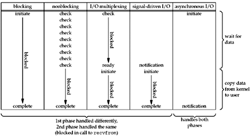
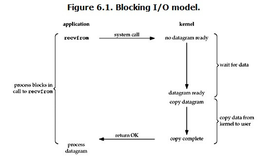
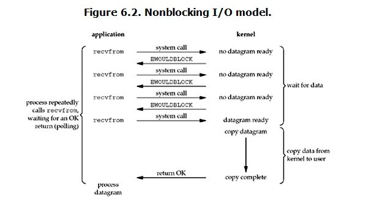
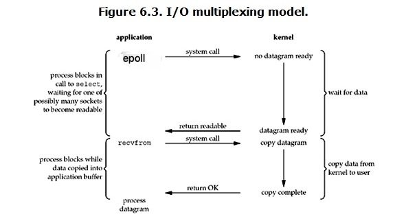
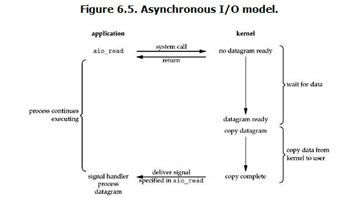

## 网络IO模型演进历程

1. 阻塞IO BIO(Blocking IO)
2. 非阻塞IO NIO(Nonblocking IO)
3. IO多路复用第一版 select/poll/epoll
4. 异步IO AIO(Async IO)

## BIO

> 阻塞 IO，顾名思义当用户发生了系统调用后，如果数据未从网卡到达内核态，内核态数据未准备好，此时会一直阻塞。直到数据就绪，然后从内核态拷贝到用户态再返回。

- BIO缺点，能支持的并发连接数比较少：
  - 一台服务器能分配的线程数是有限的
  - 大量线程频繁切换上下文会影响性能

> 核心矛盾：一个client分配一个线程是因为处理客户端读写是阻塞式的，为避免该阻塞影响接受后续新的client的连接，所以将阻塞逻辑交由单独的线程处理。

## NIO

> 非阻塞 IO：见名知意，就是在第一阶段(网卡-内核态)数据未到达时不等待，然后直接返回。因此非阻塞 IO 需要不断的用户发起请求，轮询内核。

- 优点
  - 将socket设为非阻塞后，在读取时如果数据未就绪就直接返回。可以通过一个线程管理多个client连接。
- 缺点
  - 需要不断轮询内核，数据是否已经就绪，会造成很多无效的，太频繁的系统调用(system call)而造成资源浪费。

## select/poll/epoll

- select 和 poll 的区别
  - select 能处理的最大连接，默认是 1024 个，可以通过修改配置来改变，但终究是有限个；而 poll 理论上可以支持无限个
  - select 和 poll 在管理海量的连接时，会频繁的从用户态拷贝到内核态，比较消耗资源

epoll对文件描述符的操作有两种模式： LT（level trigger）和 ET（edge trigger）。

- LT模式：当 epoll_wait 检测到描述符事件发生并将此事件通知应用程序，应用程序可以不立即处理该事件。下次调用 epoll_wait 时，会再次响应应用程序并通知此事件。
- ET模式：当 epoll_wait 检测到描述符事件发生并将此事件通知应用程序，应用程序必须立即处理该事件。如果不处理，下次调用 epoll_wait 时，不会再次响应应用程序并通知此事件。

> 简言之：边沿触发仅触发一次，水平触发会一直触发。

epoll高效的本质在于：

- 减少了用户态和内核态的文件句柄拷贝
- 减少了对可读可写文件句柄的遍历
- mmap 加速了内核与用户空间的信息传递，epoll是通过内核与用户mmap同一块内存，避免了无谓的内存拷贝
- IO性能不会随着监听的文件描述的数量增长而下降
- 使用红黑树存储fd，以及对应的回调函数，其插入，查找，删除的性能不错，相比于hash，不必预先分配很多的空间

| -     | select                        | poll                        | epoll                                                   |
|-------|-------------------------------|-----------------------------|---------------------------------------------------------|
| 操作方式  | 遍历                            | 遍历                          | 回调                                                      |
| 底层实现  | 数组                            | 链表                          | 哈希表                                                     |
| IO效率  | 每次调用都进行线性遍历，时间复杂度为O(n)        | 每次调用都进行线性遍历，时间复杂度为O(n)      | 事件通知方式，每当fd就绪，系统注册的回调函数就会被调用，将就绪fd放到rdllist里面。时间复杂度O(1) |
| 最大连接数 | 1024（x86）或 2048（x64）          | 无上限                         | 无上限                                                     |
| fd拷贝  | 每次调用select，都需要把fd集合从用户态拷贝到内核态 | 每次调用poll，都需要把fd集合从用户态拷贝到内核态 | 调用epoll_ctl时拷贝进内核并保存，之后每次epoll_wait不拷贝                  |

## AIO

## 参考连接

- [Chapter 6. I/O Multiplexing: The select and poll Functions](https://www.masterraghu.com/subjects/np/introduction/unix_network_programming_v1.3/ch06.html)
- [epoll(7) — Linux manual page](https://man7.org/linux/man-pages/man7/epoll.7.html)
- [The C10K problem](http://www.kegel.com/c10k.html)

