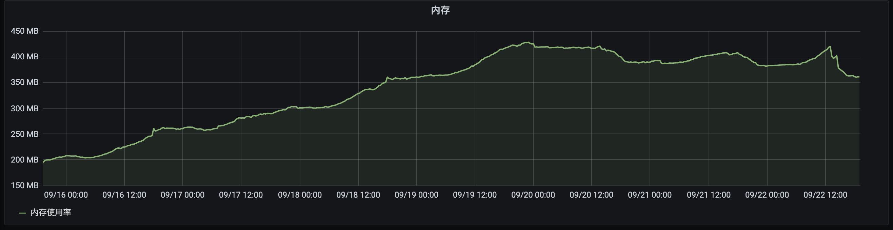
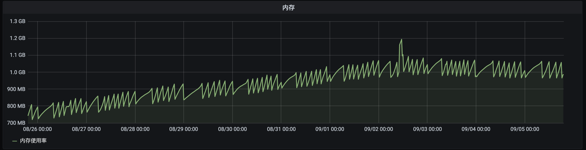
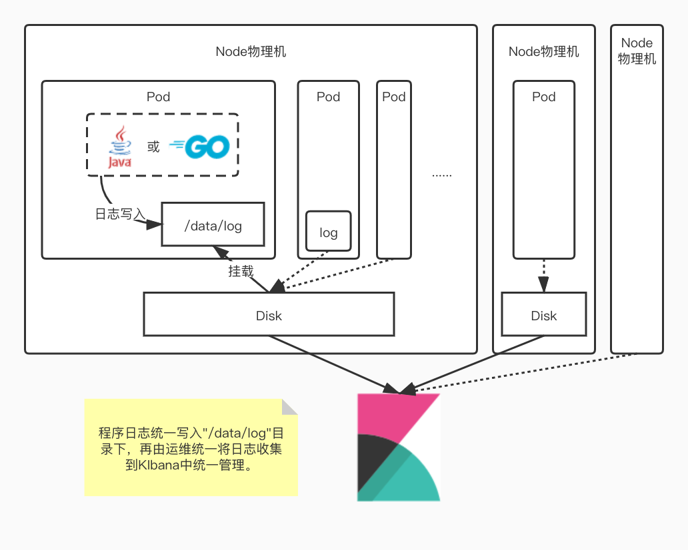
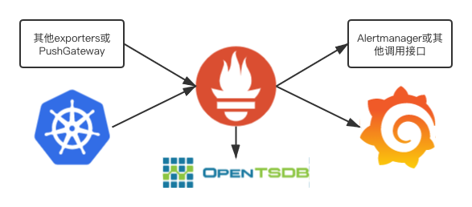
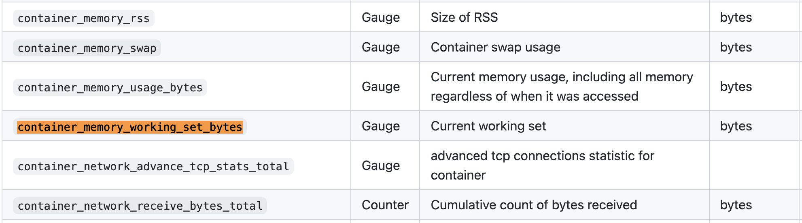
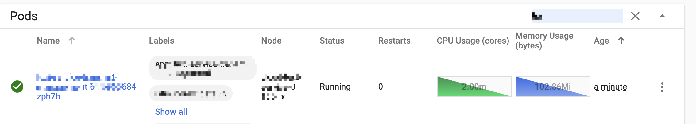
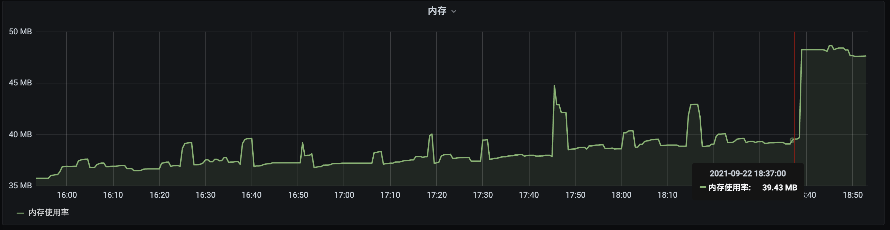
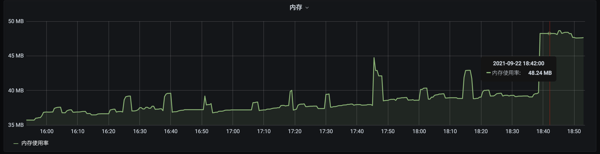

> 结合上次Golang服务内存增长的分析，近期线上多个服务出现内存持续增长的问题，就这个现象分析一下Prometheus+Grafana的监控问题


## 问题现象

近期在Grafana上显示生产环境多个服务出现内存持续增长的问题，有Golang的服务，也有JAVA的服务。都是服务重启之后，内存来到一个最低水平，
随着服务运行时间增长，pod的内存占用也随之水涨船高。直到内存占用增长到pod限制的上限附近，内存才出现回收的迹象，并且回收幅度不是特别明显，
但同时又不会出现OOM。

- Golang某个服务内存占用情况


- JAVA某个服务内存占用情况 


## 简单分析

[记一次线上的内存持续增长问题](https://ormissia.github.io/posts/problems/5000-go-online-service-oom/)  
↑这个是初次遇到这个问题时候的分析，当时以为是代码写的有漏洞，程序发生了内存泄漏。于是祭出了pprof分析了一顿，结果可想而知，当然是没看出有问题。  
现在是多个服务都出现类似问题，那这个情况相对也就比较值得重视了。之前那个服务是因为日志写的比较多，造成磁盘IO比较大。同样的，
近期发现的这几个内存持续不断增长的服务也都是日志量比较大的。

## 进一步分析

### 集群日志架构

所有pod中的日志都是写入挂载到`/data/log`目录的物理机磁盘中，因此所有写日志的操作都会有磁盘IO。日志量越大的pod，磁盘IO相应地也越高。



### 集群监控

普通pod监控采用了常见的Prometheus+Grafana的方案。



### 数据源计算方式

监控数据是采集的kubernetes中监控程序cadvisor上报的`container_memory_working_set_bytes`字段（ [表格参照](https://github.com/google/cadvisor/blob/master/docs/storage/prometheus.md) ）



查看cadvisor源码中[setMemoryStats](https://github.com/google/cadvisor/blob/80e65740c169abb5097d848f0b44debd0fa20876/container/libcontainer/handler.go#L792)
可知，`container_memory_working_set_bytes`字段是`cgroup memory.usage_in_bytes`与`memory.stat total_inactive_file`二者的差值

```golang
func setMemoryStats(s *cgroups.Stats, ret *info.ContainerStats) {
	// ...

	// ...

	inactiveFileKeyName := "total_inactive_file"
	if cgroups.IsCgroup2UnifiedMode() {
		inactiveFileKeyName = "inactive_file"
	}

	workingSet := ret.Memory.Usage
	if v, ok := s.MemoryStats.Stats[inactiveFileKeyName]; ok {
		if workingSet < v {
			workingSet = 0
		} else {
			workingSet -= v
		}
	}
	ret.Memory.WorkingSet = workingSet
}
```

而`memory.usage_in_bytes`的统计数据是包含了所有的file cache的，`total_active_file`和`total_inactive_file`都属于file cache的一部分，
但是这两个数据并不是Pod中的程序真正占用的内存，只是系统为了提高磁盘IO的效率，将读写过的文件缓存在内存中。file cache并不会随着进程退出而释放，只会当容器销毁或者系统内存不足时才会由系统自动回收。

所以cadvisor采用`memory.usage_in_bytes - total_inactive_file`计算出的结果并不是当前Pod中程序所占用的内存，当Pod内存资源紧张时`total_active_file`也是可回收利用的。

## 验证结论

### 准备环境

去测试环境找到一个服务重启一下，并进入容器命令行



### 准备一个较大的文件

找一个比较大的文件，这里找了一个8M左右的日志文件

```shell
/app # ls -lah /data/log/xxxx.log
-rw-r--r--    1 root     root        8.2M May 31 10:54 /data/log/xxxx.log
```

### 查看内存数据

在容器中进入`/sys/fs/cgroup/memory/`目录，并查看`cat memory.stat`内容

```shell
/app # cd /sys/fs/cgroup/memory/
/sys/fs/cgroup/memory # cat memory.stat
cache 38195200
rss 13484032
rss_huge 0
mapped_file 495616
swap 0
pgpgin 1550811
pgpgout 1538194
pgfault 1512338
pgmajfault 36
inactive_anon 0
active_anon 13422592
inactive_file 12058624
active_file 26136576
unevictable 0
hierarchical_memory_limit 314572800
hierarchical_memsw_limit 314572800
total_cache 38195200
total_rss 13484032
total_rss_huge 0
total_mapped_file 495616
total_swap 0
total_pgpgin 1550811
total_pgpgout 1538194
total_pgfault 1512338
total_pgmajfault 36
total_inactive_anon 0
total_active_anon 13422592
total_inactive_file 12058624
total_active_file 26136576
total_unevictable 0
```

记录此时  
total_inactive_file 12058624 Bytes = 11.5M  
total_active_file 26136576 Bytes = 24.9M

### 遍历日志文件

```shell
/sys/fs/cgroup/memory # grep "hello" /data/log/xxx.log
```

### 第二次查看内存

```shell
/sys/fs/cgroup/memory # cat memory.stat 
cache 46850048
rss 13500416
rss_huge 0
mapped_file 495616
swap 0
pgpgin 1552994
pgpgout 1538260
pgfault 1512642
pgmajfault 36
inactive_anon 0
active_anon 13459456
inactive_file 20709376
active_file 26140672
unevictable 0
hierarchical_memory_limit 314572800
hierarchical_memsw_limit 314572800
total_cache 46850048
total_rss 13500416
total_rss_huge 0
total_mapped_file 495616
total_swap 0
total_pgpgin 1552994
total_pgpgout 1538260
total_pgfault 1512642
total_pgmajfault 36
total_inactive_anon 0
total_active_anon 13459456
total_inactive_file 20709376
total_active_file 26140672
total_unevictable 0
```

记录此时  
total_inactive_file 20709376 Bytes = 19.6M  
total_active_file 26140672 Bytes = 24.9M

此时`total_inactive_file`占用较上次增加大约8M左右，即遍历过的日志文件的大小。

### 第二次遍历日志文件

对同一个文件第二次遍历访问

```shell
/sys/fs/cgroup/memory # grep "hello" /data/log/xxx.log
```

### 第三次查看内存

```shell
/sys/fs/cgroup/memory # cat memory.stat 
cache 46850048
rss 13504512
rss_huge 0
mapped_file 495616
swap 0
pgpgin 1553058
pgpgout 1538323
pgfault 1512941
pgmajfault 36
inactive_anon 0
active_anon 13459456
inactive_file 12025856
active_file 34824192
unevictable 0
hierarchical_memory_limit 314572800
hierarchical_memsw_limit 314572800
total_cache 46850048
total_rss 13504512
total_rss_huge 0
total_mapped_file 495616
total_swap 0
total_pgpgin 1553058
total_pgpgout 1538323
total_pgfault 1512941
total_pgmajfault 36
total_inactive_anon 0
total_active_anon 13459456
total_inactive_file 12025856
total_active_file 34824192
total_unevictable 0
```

记录此时  
total_inactive_file 12025856 Bytes = 11.5M  
total_active_file 34824192 Bytes = 33.2M

此时`total_inactive_file`较上次减少8M，而`total_active_file`较上次增加8M

### 查看Grafana

- 遍历日志文件之前


- 遍历日志文件之后


此时查看对应服务的Grafana面板可以看到，使用shell的`grep`命令遍历一个8M多的文件之后，在Pod中内存占用上升了大概8M。
而此时这块内存并没有被Pod中任何程序所引用，只是一个file cache的占用。

## 总结

根据上述实验结果可以印证内存持续增长但不会OOM的现象。服务启动并向磁盘中持续追加日志文件，随之file cache持续上涨，直至达到Pod的内存上限之后，会出现GC。

## 结论

`memory.usage_in_bytes`统计包含了`Cached`和`Buffers`，`Cached`中除了`mlock_file`和`Shmem`（IPCS shared memory & tmpfs）外，
其他部分`file cache`是可以回收使用的，`Buffers`也是可以回收利用的，所以Pod容器所在cgroup实际使用的内存计算公式可以转化为
(因`memory.stat`未导出`SReclaimable`，这里忽略`SReclaimable`)：

```shell
real_used = memory.usage_in_bytes – (Cached- Shmem - mlock_file + Buffers )  
          = memory.usage_in_bytes – memory.stat .( total_inactive_file + total_active_file )
```

因此cadvisor中`container_memory_working_set_bytes`字段在计算实际已使用内存时应该改为：

```shell
real_used = memory.usage_in_bytes – memory.stat.total_inactive_file - memory.stat.total_active_file
```

## 但是

过程中去[kubernetes](https://github.com/kubernetes/kubernetes) 的[issue](https://github.com/kubernetes/kubernetes/issues)
中逛了一圈，发现了几个相关问题的讨论：

- [https://github.com/kubernetes/kubernetes/issues/43916](https://github.com/kubernetes/kubernetes/issues/43916)
- [https://github.com/kubernetes/kubernetes/issues/104533](https://github.com/kubernetes/kubernetes/issues/104533)

其中一个给我笑出声  
`kubernetes should not count active_file as used memory, I have been waiting for 4 years!`

等了四年了，这个问题还没有解决。**也许，我们从一开始就错了？缓存也应该算是pod内存占用？**
