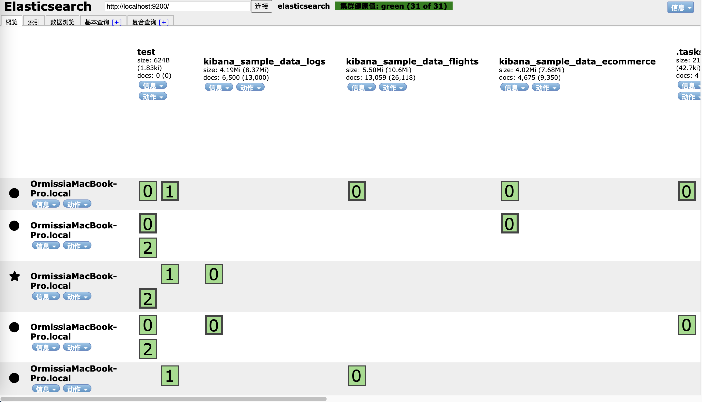
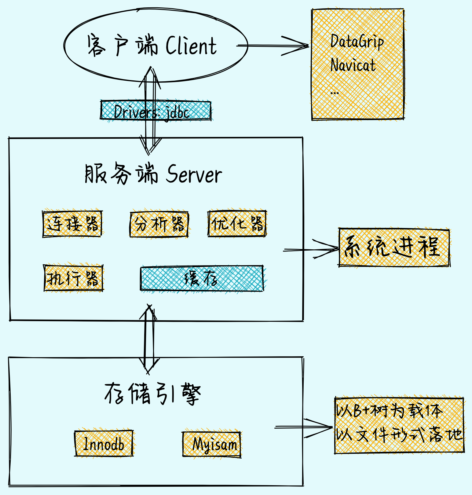
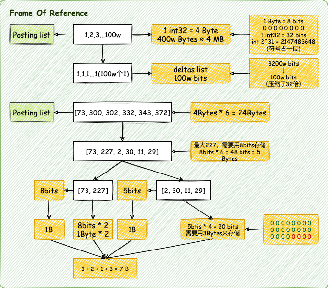
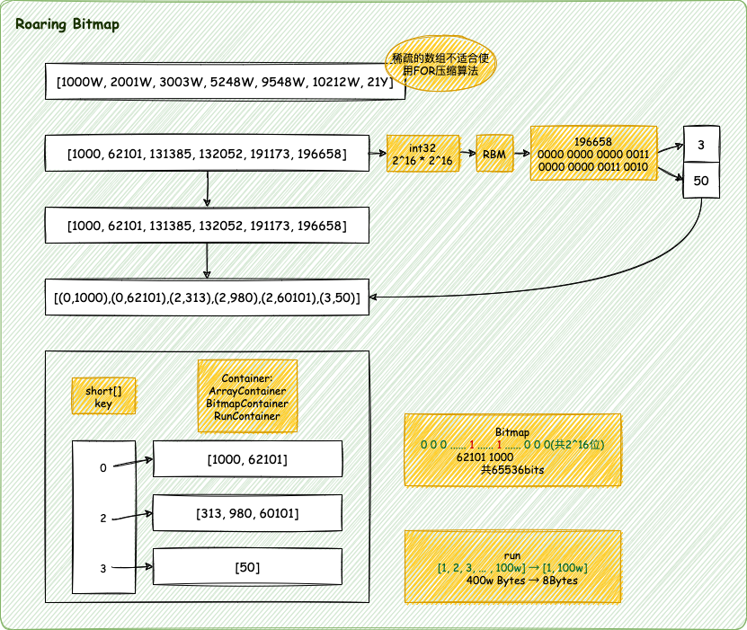

## 搜索类型

- 搜索引擎：百度、搜狗、谷歌、必应
- 垂直领域：各大电商平台、OA系统、站内搜索
- 商业智能：数据分析、数据挖掘、用户画像
- GitHub：千亿+行代码秒查
- 日志系统：ELK

## ES特点

- 搜索、聚合分析、大数据存储
- 分布式、高性能、高可用、可伸缩、易维护
- 支持文本搜索、结构化数据、非结构化数据、地理位置搜索等

## ES单机部署

### 同一节点启动不同服务

```shell
./bin/elasticsearch -E path.data=data1 -E path.logs=log1 -E node.name=node1 -E cluster.name=ormissia_test
./bin/elasticsearch -E path.data=data2 -E path.logs=log2 -E node.name=node2 -E cluster.name=ormissia_test
```

```shell
http://localhost:9200/
http://localhost:9201/
```

### 不同节点启动同一服务

```shell
open ./elasticsearch_node1/bin/elasticsearch
open ./elasticsearch_node2/bin/elasticsearch
open ./elasticsearch_node3/bin/elasticsearch
open ./elasticsearch_node4/bin/elasticsearch
open ./elasticsearch_node5/bin/elasticsearch

open ./kibana-7.15.1-darwin-x86_64/bin/kibana
```

## `elasticsearch-head`插件

[GitHub Repository](https://github.com/mobz/elasticsearch-head)

```shell
git clone git://github.com/mobz/elasticsearch-head.git
cd elasticsearch-head
npm install
npm run start
```

默认端口：9100

> 如果集群无法连接，需要修改ES配置文件

```yaml
http.cors.enabled: true
http.cors.allow-origin: "*"
```



> `elasticsearch-head`也可以以Chrome插件的方式安装

### 集群健康值检查

#### 健康值状态

- `Grenn`：所有Primary和Replica均为active，集群健康
- `Yellow`：至少有一个Replica不可用，但是所有Primary均为active，数据仍然是可以保证完整性的
- `Red`：至少有一个Primary为不可用状态，数据不完整，集群不可用

> `Replica`是不可以写的


#### 健康值检查

1. `_cat/health`

```
GET _cat/health?v
```

```shell
epoch      timestamp cluster       status node.total node.data shards pri relo init unassign pending_tasks max_task_wait_time active_shards_percent
1634624559 06:22:39  elasticsearch green           5         5     24  12    0    0        0             0                  -                100.0%
格林尼治时间           集群名称        集群状态     节点数   数据节点 分片 Primary                   准备执行任务数   最大任务等待时间           当前活动分片百分比
```

2. `_cluster/health`

```
GET _cluster/health
```

```json
{
  "cluster_name" : "elasticsearch",
  "status" : "green",
  "timed_out" : false,
  "number_of_nodes" : 5,
  "number_of_data_nodes" : 5,
  "active_primary_shards" : 12,
  "active_shards" : 24,
  "relocating_shards" : 0,
  "initializing_shards" : 0,
  "unassigned_shards" : 0,
  "delayed_unassigned_shards" : 0,
  "number_of_pending_tasks" : 0,
  "number_of_in_flight_fetch" : 0,
  "task_max_waiting_in_queue_millis" : 0,
  "active_shards_percent_as_number" : 100.0
}
```

注释

```shell
# "relocating_shards" : 0,     迁移中
# "initializing_shards" : 0,   初始化中
# "unassigned_shards" : 0,     未分配的
```

## 搜索引擎

### 搜索引擎类别

- 全文搜索引擎：自然语言处理（NLP）、爬虫、网页处理、大数据处理，如谷歌、百度、搜狗、必应等
- 垂直搜索引擎：有明确目的的搜索行为，如各大电商网站、OA系统、站内搜索、视频网站等

### 搜索引擎要求

- 查询速度快
  - 高效的压缩算法
  - 快速的编码和解码速度
- 结果准确
  - BM25评分算法（7.0之后）
  - TF-IDF
- 检验结果丰富
  - 召回率

### Lucene

> 以MySQL为例的数据库组成结构



MySQL索引面临大数据检索的问题：
1. 索引失效
2. 精准度差
3. 大数据量下索引性能变低

Lucene使用倒排索引解决了上述问题

#### 倒排索引核心算法

- 倒排索引表的压缩算法
  - FOR: Frame Of Reference
  - RBM: RoaringBitMap
- 词项索引的检索原理
  - FST: Finit state Transducers


##### FOR



##### RBM



##### FST

FSA：有限状态接收机
FST：有限状态转换机

FST最重要的功能是实现`key`到`value`的映射，相当于`HashMap`。  
FST的查询比HashMap要慢一点，但FST的内存消耗要比HashMap少很多。  
FST在Lucene中被大量使用，如：倒排索引的存储，同义词词典的存储，搜索关键词建议等

Node 节点

Acr 出度
freezeTail 尾部冻结

通用最小化算法：BitMap

## ES简单的CRUD

> 示例使用`Kibana`的`Dev Tools`操作

### 创建索引

创建`test`索引

```
PUT /test
```

### 查询索引

查询`test`索引

```
GET /test
```

### 添加一条文档

创建索引为`1`的一条文档

```
PUT /test/_doc/1
{
  "name": "xiaoming",
  "age": 123,
  "tag": [
    "pople",
    "student"
  ]
}
```

### 查询文档

根据索引查询文档

```
GET /test/_doc/1
```

### 修改文档

根据索引修改文档

```
POST /test/_update/1
{
  "doc": {
    "age": 222
  }
}
```

## Mapping

> 定义ES索引中字段类型等信息的映射，映射是定义文档及其包含的字段的存储和索引方式的过程，换句话来说，`Mapping`相当于传统关系型数据库中的`DDL`建表语句。  
> 在Mapping里也包含了一些属性，比如字段名称、类型、字段使用的分词器、是否评分、是否创建索引等属性，并且在ES中一个字段可以有多个类型。

Mapping类型：

- `Dynamic mapping`：动态映射
- `Explicit mapping`：显式映射

### 查看Mapping

```
GET /index/_mapping
```

### 数据类型

1. **基础类型**
   1. **数字类型**：`long`、`integer`、`short`、`byte`、`double`、`float`、`half_float`、`scaled_float`、`unsigned_long`
   2. **Keywords**：
      1. Keywords适用于索引结构化的字段，可以用于过滤、排序、聚合。`keyword`类型的字段只能通过精确值（exact value）搜索到。id应该用`keyword`
      2. constant_keyword：始终包含相同值的关键字字段
      3. wildcard：可针对类似`grep`的通配符查询优化日志行和类似的关键字值
   3. **Dates**（时间类型）：包括[`Date`](https://www.elastic.co/guide/en/elasticsearch/reference/current/date.html)和 [`Date nanoseconds`](https://www.elastic.co/guide/en/elasticsearch/reference/current/date_nanos.html)
   4. **Alias**：为现有字段定义别名
   5. Binary：二进制
   6. Range：区间类型，`integer_range`、`float_range`、`long_range`、`double_range`、`date_range`
   7. **text**：当一个字段是要被全文搜索的，比如Email内容、产品描述，这些字段应该使用text类型。设置text类型以后，字段内容会被分析，在生成倒排索引以前，字符串会被分析器分成一个一个词项。text类型的字段不用于排序，很少用于聚合。（解释一下为啥不会为text创建正排索引：大量堆空间，尤其是在加载高基数text字段时。字段数据一旦加载到堆中，就在该段的生命周期内保持在那里。同样，加载字段数据是一个昂贵的过程，可能导致用户遇到延迟问题。这就是默认情况下禁用字段数据的原因）
2. **对象关系类型**
   1. **Object**：用于单个JSON对象
   2. **Nested**：用于JSON对象数组
   3. flattened：允许将整个JSON对象索引为单个字段。
3. 结构化类型
   1. **Geopoint**：纬度/经度积分
   2. **Geoshape**：用于多边形等复杂形状
   3. **Point**：笛卡尔坐标点
   4. **Shape**：笛卡尔任意几何图形
4. 特殊类型
   1. **IP**：用于IPv4和IPv6地址
   2. ~~**Completion**：提供自动完成建议~~  // TODO
   3. **Token count**：计算字符串中令牌的数量
   4. ...
5. Array（数组）：在ES中，数组不需要专用的字段数据类型。默认情况下，任何字段都可以包含零个或多个值，但是，数组中的所有值都必须具有相同的数据类型。
6. 版本新增
   1. Date nanoseconds
   2. ...

> **除了支持的映射参数之外，无法更改现有字段的映射或字段类型。更改现有字段可能会使已编入索引的数据无效。**

### Dynamic mapping字段对应关系

|内容|类型|
|---|---|
|整数|long|
|浮点数|float|
|true/false|boolean|
|日期|date|
|数组|取决于数组中的第一个有效值|
|对象|object|
|字符串|如果不是数字和日期类型，那会被映射为text和keyword两个类型|

---

> 除了上述字段类型之外，其他类型都必须显式映射，也就是必须手工指定，因为其他类型ES无法自动识别。

### Explicit mapping显式映射

```
PUT /my-index-000001
{
  "mappings": {
    "properties": {
      "age":    { "type": "integer" },  
      "email":  { "type": "keyword"  }, 
      "name":   { "type": "text"  }
    }
  }
}
```

> **再次注明：除了支持的映射参数之外，无法更改现有字段的映射或字段类型。更改现有字段可能会使已编入索引的数据无效。**

### 参数

1. **index**：是否对创建对当前字段创建倒排索引，默认true，如果不创建索引，该字段不会通过索引被搜索到,但是仍然会在source元数据中展示
2. **analyzer**：指定分析器，`Character filter`、`Tokenizer`、`Token filters`
3. boost：对当前字段相关度的评分权重，默认1
4. coerce：是否允许强制类型转换  true “1”=> 1  false “1”=< 1
5. **doc_values**：为了提升排序和聚合效率，默认true，如果确定不需要对字段进行排序或聚合，也不需要通过脚本访问字段值，则可以禁用doc值以节省磁盘空间（不支持text和annotated_text）
6. dynamic：控制是否可以动态添加新字段
   1. true：新检测到的字段将添加到映射中。（默认）
   2. false：新检测到的字段将被忽略。这些字段将不会被索引，因此将无法搜索，但仍会出现在_source返回的匹配项中。这些字段不会添加到映射中，必须显式添加新字段。
   3. strict：如果检测到新字段，则会引发异常并拒绝文档。必须将新字段显式添加到映射中
7. **eager_global_ordinals**：用于聚合的字段上，优化聚合性能。
8. Frozen indices：冻结索引，有些索引使用率很高，会被保存在内存中，有些使用率特别低，宁愿在使用的时候重新创建，在使用完毕后丢弃数据，Frozen indices的数据命中频率小，不适用于高搜索负载，数据不会被保存在内存中，堆空间占用比普通索引少得多，Frozen indices是只读的，请求可能是秒级或者分钟级。**eager_global_ordinals不适用于Frozen indices**
9. **enable**：是否创建倒排索引，可以对字段操作，也可以对索引操作，如果不创建索引，仍然可以检索并在_source元数据中展示，谨慎使用，该状态无法修改。
10. **fielddata**：查询时内存数据结构，在首次用当前字段聚合、排序或者在脚本中使用时，需要字段为fielddata数据结构，并且创建倒排索引保存到堆中。 
11. **fields**：给field创建多字段，用于不同目的（全文检索或者聚合分析排序）
12. format：格式化
    ```
      "date": {
         "type":  "date",
         "format": "yyyy-MM-dd"
       }
    ```
13. **norms**：是否禁用评分（在filter和聚合字段上应该禁用）。
14. null_value：为null值设置默认值
15. search_analyzer：设置单独的查询时分析器
16. store：设置字段是否仅查询
17. ...

## Query DSL(Domain Specific Language)

### 查询上下文

> 使用`query`关键字进行检索，倾向于相关度搜索，需要计算相关度评分。

### 相关度评分`_score`

相关度评分用于对搜索结果排序，评分越高则认为其结果和搜索的预期值相关度越高，即越符合搜索预期值。在7.x之前相关度评分默认使用TF/IDF算法计算而来，7.x之后默认为BM25。  
相关度评分为搜索结果的排序依据，默认情况下评分越高，则结果越靠前。

### 元数据`_source`

禁用_source

```
GET product/_search
{
  "_source": false, 
  "query": {
    "match_all": {}
  }
}
```

- 好处：节省存储开销
- 坏处：
  - 不支持update、update_by_query和reindex API。
  - 不支持高亮。
  - 不支持reindex、更改mapping分析器和版本升级。
  - 通过查看索引时使用的原始文档来调试查询或聚合的功能。
  - 将来有可能自动修复索引损坏。

**总结：如果只是为了节省磁盘，可以压缩索引比禁用_source更好。**

数据源过滤器

- `Including`：结果中返回哪些field
- `Excluding`：结果中不要返回哪些field，不返回的field不代表不能通过该字段进行检索，因为元数据不存在不代表索引不存在

_在`mapping`中定义过滤：支持通配符，但是这种方式不推荐，因为`mapping`不可变_

```
GET product/_search
{
  "_source": ["owner.name","owner.sex"], 
  "query": {
    "match_all": {}
  }
}
```

常用过滤规则

- ```
  "_source": "false",
  ```
- ```
  "_source": "obj.*",
  ```
- ```
  "_source": [ "obj1.\*", "obj2.\*" ],
  ```
- ```
  "_source": {
            "includes": [ "obj1.\*", "obj2.\*" ],
            "excludes": [ "*.description" ]
          }
  ```

### Query String

- 查询所有：`GET /product/_search`
- 带参数：`GET /product/_search?q=name:productname`
- 分页：`GET /product/_search?from=0&size=2&sort=price:asc`
- 精准匹配：`GET /product/_search?q=date:2021-10-21`
- _all搜索（相当于在所有有索引的字段中检索）：`GET /product/_search?q=2021-06-01`

### 全文检索-Fulltext query

```
GET index/_search
{
  "query": {
    ***
  }
}
```

示例

```
GET product/_search
{
  "query": {
    "match": {
      "name": "huahua blue cat"
    }
  }
}
```

- `match`：匹配包含某个term的子句
- `match_all`：匹配所有结果的子句
- `multi_match`：多字段条件
- `match_phrase`：短语查询，分词结果必须在被检索字段的分词中都包含，而且顺序必须相同，而且默认必须都是连续的

### 精准查询-Term query

`term`：匹配和搜索词项完全相等的结果

- `term`和`match_phrase`区别:
  - `match_phrase`会将检索关键词分词,`match_phrase`的分词结果必须在被检索字段的分词中都包含，而且顺序必须相同，而且默认必须都是连续的
  - `term`搜索不会将搜索词分词
- `term`和`keyword`区别
  - `term`是对于搜索词不分词,
  - `keyword`是字段类型,是对于`source data`中的字段值不分词

```
# term
GET product/_search
{
  "query": {
    "term": {
      "name": "xiaomi phone"
    }
  }
}
#term和match_phrase区别
GET product/_search
{
  "query": {
    "match_phrase": {
      "name": "blue cat"
    }
  }
}
#term和keyword的区别
GET product/_search
{
  "query": {
    "term": {
      "name.keyword": "blue cat"
    }
  }
}
```

`terms`：匹配和搜索词项列表中任意项匹配的结果（数据中的`tags`字段只要有任意一项就可以查到）

```
GET product/_search
{
  "query": {
    "terms": {
      "tags": [ "aaaaaa", "cat" ],
      "boost": 1.0
    }
  }
}
```

`range`：范围查找

```
GET /_search
{
  "query": {
    "range": {
      "price": {
        "gte": 1000,
        "lte": 20000
      }
    }
  }
}
GET product/_search
{
  "query": {
    "range": {
      "date": {
        "time_zone": "+08:00",
        "gte": "2021-10-21",
        "lt": "2021-10-21"
      }
    }
  }
}
GET product/_search
{
  "query": {
    "range": {
      "date": {
        "gte": "now-1d/d",
        "lt": "now/d"
      }
    }
  }
}
```

### 过滤器-Filter

> query和filter的主要区别在：filter是结果导向的而query是过程导向。query倾向于“当前文档和查询的语句的相关度”而filter倾向于“当前文档和查询的条件是不是相符”。即在查询过程中，query是要对查询的每个结果计算相关性得分的，而filter不会。另外filter有相应的缓存机制，可以提高查询效率。

```
GET product/_search
{
  "query": {
    "constant_score": {
      "filter": {
        "term": {
          "name": "phone"
        }
      },
      "boost": 1.2
    }
  }
}
```

### 组合查询-Bool query

> 可以组合多个查询条件，bool查询也是采用`more_matches_is_better`的机制，因此满足must和should子句的文档将会合并起来计算分值

- **must**：必须满足子句（查询）必须出现在匹配的文档中，并将有助于得分。
- **filter**：过滤器，不计算相关度分数，cache子句（查询）必须出现在匹配的文档中。但是不像must查询的分数将被忽略。Filter子句在filter上下文中执行，这意味着计分被忽略，并且子句被考虑用于缓存。
- **should**：可能满足，or子句（查询）应出现在匹配的文档中。
- **must_not**：必须不满足，不计算相关度分数，not子句（查询）不得出现在匹配的文档中。子句在过滤器上下文中执行，这意味着计分被忽略，并且子句被视为用于缓存。由于忽略计分，因此将返回所有文档的分数。

**minimum_should_match**：参数指定should返回的文档必须匹配的子句的数量或百分比。如果bool查询包含至少一个should子句，而没有must或 filter子句，则默认值为1。否则，默认值为0

## 分词器

### normalization 文档规范化,提高召回率

拼写错误、形容词、单复数、动词、大小写、分词、称谓等转换成标准词汇

```
GET _analyze
{
  "text": "Mr. Ma is an excellent teacher",
  "analyzer": "pattern"
}
```

### character filter 字符过滤器

> 分词之前的预处理，过滤无用字符

#### HTML Strip

```
PUT test_index
{
  "settings": {
    "analysis": {
      "char_filter": {
        "my_char_filter": {
          "type": "html_strip",
          "escaped_tags": [
            "a"
          ]
        }
      },
      "analyzer": {
        "my_analyzer": {
          "tokenizer": "keyword",
          "char_filter": "my_char_filter"
        }
      }
    }
  }
}

GET test_index/_analyze
{
  "analyzer": "my_analyzer",
  "text": "<p>I&apos;m so <a>happy</a>!</p>"
}
```

#### Mapping

```
PUT test_index
{
  "settings": {
    "analysis": {
      "char_filter": {
        "my_char_filter": {
          "type": "mapping",
          "mappings":[
            "滚 => *",
            "垃圾 => **"
            ]
        }
      },
      "analyzer": {
        "my_analyzer": {
          "tokenizer": "keyword",
          "char_filter": "my_char_filter"
        }
      }
    }
  }
}

GET test_index/_analyze
{
  "analyzer": "my_analyzer",
  "text": "滚！你就是个垃圾"
}
```

#### Pattern Replace 

```
PUT test_index
{
  "settings": {
    "analysis": {
      "char_filter": {
        "my_char_filter": {
          "type": "pattern_replace",
          "pattern":"(\\d{3})\\d{4}(\\d{4})",
          "replacement":"$1****$2"
        }
      },
      "analyzer": {
        "my_analyzer": {
          "tokenizer": "keyword",
          "char_filter": "my_char_filter"
        }
      }
    }
  }
}

GET test_index/_analyze
{
  "analyzer": "my_analyzer",
  "text": "手机号是：15633334444"
}
```

### token filter 令牌过滤器

> 停用词、时态转换、大小写转换、同义词转换、语气词处理等。比如：has=>have  him=>he  apples=>apple  the/oh/a=>干掉

### tokenizer 分词器

常见分词器
- standard analyzer：默认分词器，中文支持的不理想，会逐字拆分。
- pattern tokenizer：以正则匹配分隔符，把文本拆分成若干词项。
- simple pattern tokenizer：以正则匹配词项，速度比pattern tokenizer快。
- whitespace analyzer：以空白符分隔

custom analyzer 自定义分词器
- char_filter：内置或自定义字符过滤器 。
- token filter：内置或自定义token filter 。
- tokenizer：内置或自定义分词器。

### ik分词（中文分词器）

#### 安装

下载对应版本，解压后放到ES的`plugins`文件夹下面

```shell
es-root/plugins/ && mkdir ik
```

重启ES

```
GET test_index/_analyze
{
  "analyzer": "ik_max_word",
  "text": [
    "我爱中华人民共和国"
  ]
}
```

#### 文件

- `IKAnalyzer.cfg.xml`：IK分词配置文件
- `main.dic`：主词库
- `stopword.dic`：英文停用词，不会建立在倒排索引中
- 特殊词库：
  - `quantifier.dic`：特殊词库：计量单位等
  - `suffix.dic`：特殊词库：行政单位
  - `surname.dic`：特殊词库：百家姓
  - `preposition`：特殊词库：语气词
  - 自定义词库：网络词汇、流行词、自造词等

#### 热更新

- 远程词库文件
  - 词库的管理不方便，要操作直接操作磁盘文件，检索页很麻烦
  - 文件的读写没有专门的优化性能不好
  - 多一层接口调用和网络传输
- ik访问数据库

## 聚合查询

> 用于进行聚合的字段必须是`exact value`，分词字段不可进行聚合。
> 对于text字段如果需要使用聚合，需要开启`fielddata`，但是通常不建议，因为`fielddata`是将聚合使用的数据结构由磁盘（doc_values）变为了堆内存（field_data），大数据的聚合操作很容易导致OOM。

### 聚合分类

1. 分桶聚合`Bucket agregations`：类比SQL中的group by的作用，主要用于统计不同类型数据的数量
2. 指标聚合`Metrics agregations`：主要用于最大值、最小值、平均值、字段之和等指标的统计
3. 管道聚合`Pipeline agregations`：用于对聚合的结果进行二次聚合，如要统计绑定数量最多的标签bucket，就是要先按照标签进行分桶，再在分桶的结果上计算最大值。

### 桶聚合：

场景：用于统计不同种类的文档的数量，可进行嵌套统计。

函数：terms

注意：聚合字段必须是`exact value`，如`keyword`

### 指标聚合

场景：用于统计某个指标，如最大值、最小值、平均值，可以结合桶聚合一起使用，如按照商品类型分桶，统计每个桶的平均价格。

函数：平均值：Avg、最大值：Max、最小值：Min、求和：Sum、详细信息：Stats、数量：Value count

### 管道聚合

场景：用于对聚合查询的二次聚合，如统计平均价格最低的商品分类，即先按照商品分类进行桶聚合，并计算其平均价格，然后对其平均价格计算最小值聚合

函数：Min bucket：最小桶、Max bucket：最大桶、Avg bucket：桶平均值、Sum bucket：桶求和、Stats bucket：桶信息

注意：buckets_path为管道聚合的关键字，其值从当前聚合统计的聚合函数开始计算为第一级。比如下面例子中，my_aggs和my_min_bucket同级，my_aggs就是buckets_path值的起始值。

## 脚本查询

> Scripting是Elasticsearch支持的一种专门用于复杂场景下支持自定义编程的强大的脚本功能，ES支持多种脚本语言，如painless，其语法类似于Java,也有注释、关键字、类型、变量、函数等，其就要相对于其他脚本高出几倍的性能，并且安全可靠，可以用于内联和存储脚本。

### 支持的语言

1. `groovy`：ES 1.4.x-5.0的默认脚本语言
2. `painless`：Elasticsearch现在的默认脚本语言
3. `expression`：每个文档的开销较低：表达式的作用更多，可以非常快速地执行，甚至比编写native脚本还要快，支持javascript语法的子集：单个表达式。缺点：只能访问数字，布尔值，日期和geo_point字段，存储的字段不可用
4. `mustache`：脚本模板

## 模糊查询

## 搜索推荐

## 数据建模


## ES学习总结


通用最小化算法：BitMap
倒排索引压缩算法中的RBM算法中用到了Bitmap，在Redis的布隆过滤器中也用到了

倒排索引的 ，在Linux文件权限中也用到了


## 参考链接

- [Elastic stack版本支持](https://www.elastic.co/cn/support/matrix)
- [Elasticsearch Head GitHub Repository](https://github.com/mobz/elasticsearch-head)
- [ik分词器](https://github.com/medcl/elasticsearch-analysis-ik)

