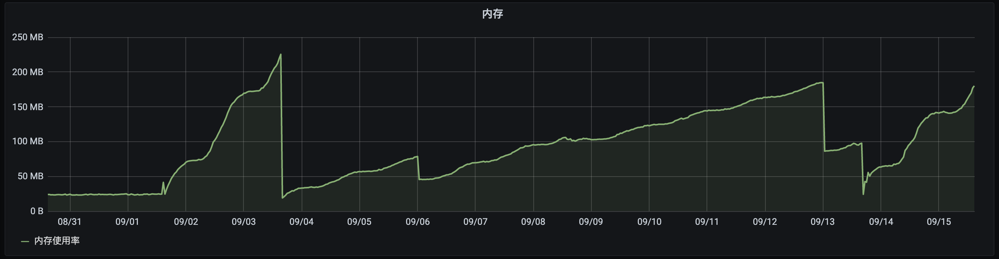
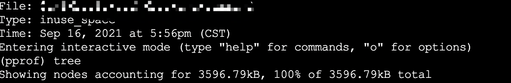
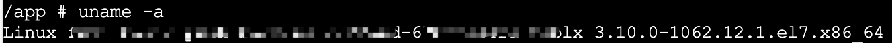
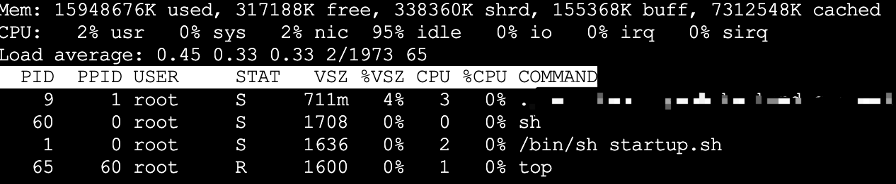

---


---

## 问题现象

前些天从Grafana上看到某一个pod内存涨上去就再没下来（从9/1~9/2之间的一个时间开始），并且看这个趋势涨上去就没有下来的意思。中间有几次pod重新发布
才导致内存恢复到一个比较低的水平，但内存依旧持续上涨。



## 初步分析

初步推测大概率与日志有关，此次发版改动了日志输出格式，以及修改了日志没有写入磁盘的问题。

## 先把服务稳住

由于清楚问题的大致方向，先将服务中几个打印log比较频繁的位置注释掉，在9/3~9/4之间的一个位置重新发布。从之后的趋势上可以看出，注释掉几个打印日志的
地方之后，内存增长速度明显放缓。

至此，基本可以确认内存增长与日志相关。

## 问题排查

### 猜测一

回头又捋了几遍代码，也没发现什么端倪。  
于是祭出pprof抓了一下内存分析了一通，依旧无果。



可以看出，内存占用并没有多高。

### 猜测二

- 在 Go1.12 以前，Go Runtime在Linux上使用的是`MADV_DONTNEED`策略，可以让RSS下降的比较快，就是效率差点。
- 在 Go1.12 及以后，Go Runtime专门针对其进行了优化，使用了更为高效的`MADV_FREE`策略。但这样子所带来的副作用就是RSS不会立刻下降，
  要等到系统有内存压力了才会释放占用，RSS才会下降。

查看容器的 Linux 内核版本：

```shell
# 查看命令
uname -a
```



课件容器版本为`3.10.0`，但`MADV_FREE`的策略改变，需要Linux内核在4.5及以上（详细可见[go/issues/23687](https://github.com/golang/go/issues/23687) ），
因此可以排除。

## 猜想三



通过`top`命令可以通过可以查看容器中程序的内存占用`VSZ`为711，无法查看`RSS`，关于RSS和VSZ的区别，可以参考[RSS和VSZ](https://ormissia.github.io/notes/linux/system/system/)

容器内存判定是通过`container_memory_working_set_bytes`，而`container_memory_working_set_bytes`是由`cadvisor`提供的。

## 原因

从[cadvisor/issues/638](https://github.com/google/cadvisor/issues/638) 可得知`container_memory_working_set_bytes`指标的组
成实际上是`RSS + Cache`。而Cache高的情况，常见于进程有大量文件IO，占用Cache可能就会比较高，猜测也与Go版本、Linux 内核版本的Cache释放、回收方式有较大关系。
只要是涉及有大量文件IO的服务，基本上是这个问题的老常客了，写这类服务基本写一个中一个，因为这是一个混合问题，像其它单纯操作为主的业务服务就很 “正常”，不会出现内存居高不下。

没多久看到烤鱼佬的一篇文章，与这个情况类似，他的解决办法也就是写了个脚本，"手动"HPA（其实也就是自动重启）。

## 总结

虽然这问题时间跨度比较长，整体来讲都是阶段性排查，本质上可以说是对Kubernetes的不熟悉有关。但因为内存居高不下的可能性有很多种，要一个个排查。
