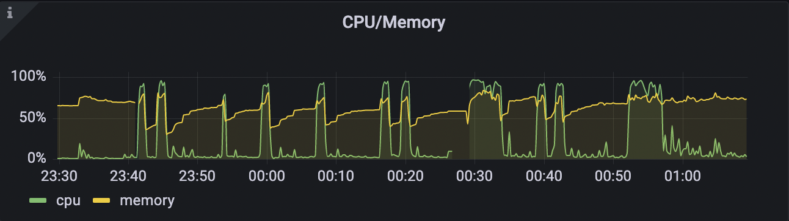

---

#elastic #elasticsearch

---

## 问题现象

按照ES官网文档介绍的安装步骤，使用`yum`的方式进行安装。安装完成之后，使用如下命令启动：

```shell
systemctl start elasticsearch.service
```

控制台阻塞一会后，显示启动失败，使用如下命令查看状态：

```shell
systemctl status elasticsearch.service
```

查询状态为：

```shell
Warning: The unit file, source configuration file or drop-ins of elasticsearch.service changed on disk. Run 'systemctl daemon-reload' to reload units.
● elasticsearch.service - Elasticsearch
   Loaded: loaded (/usr/lib/systemd/system/elasticsearch.service; disabled; vendor preset: disabled)
   Active: failed (Result: timeout) since Thu 2021-10-14 00:42:40 CST; 2min 15s ago
     Docs: https://www.elastic.co
 Main PID: 2547 (code=exited, status=143)

Oct 14 00:41:22 gateway systemd[1]: Starting Elasticsearch...
Oct 14 00:41:29 gateway bash[2547]: [0.003s][warning][logging] Output options for existing outputs are ignored.
Oct 14 00:41:35 gateway systemd[1]: elasticsearch.service: Current command vanished from the unit file, execution of the command list won't be resumed.
Oct 14 00:42:37 gateway systemd[1]: elasticsearch.service: start operation timed out. Terminating.
Oct 14 00:42:40 gateway systemd[1]: elasticsearch.service: Failed with result 'timeout'.
Oct 14 00:42:40 gateway systemd[1]: Failed to start Elasticsearch.
```

_注意第四行`Active: failed (Result: timeout)`中的这个`timeout`，后面会成为关键，只是刚开始的时候没注意到。_


## 初步分析

首先到ES的日志目录`/var/log/elasticsearch/`下查看日志。  
主要有这几个文件：
- `elasticsearch.log`
- `elasticsearch_server.json`
- `gc.log*`

全部找了一遍，也没有发现`ERROR`的日志。

### 内存不足

找不到报错的信息，就只能先猜测一下最可能的原因了。  
起初以为是内存的问题，因为这台服务器内存比较小，而且已经再跑了一些其他服务了。回去重新查看日志，也没有发现`OOM`的日志。  
于是先在本地下了一个ES程序测试一下。

参照[官网的堆内存设置文档](https://www.elastic.co/guide/en/elasticsearch/reference/7.15/advanced-configuration.html#set-jvm-heap-size)  
选择以临时环境变量的设置方式启动ES：

```shell
ES_JAVA_OPTS="-Xms2g -Xmx2g" ./bin/elasticsearch
```

逐步调整堆内存大小，最后发现设置在`150m`的时候ES能正常启动，设置在`100m`的时候则会报`OOM`:

```shell
[2021-10-14T10:12:20,583][INFO ][o.e.m.j.JvmGcMonitorService] [MacBook-Pro.local] [gc][5] overhead, spent [430ms] collecting in the last [1.1s]
java.lang.OutOfMemoryError: Java heap space
Dumping heap to data/java_pid24385.hprof ...
Heap dump file created [152347235 bytes in 3.515 secs]
[2021-10-14T10:12:26,083][WARN ][o.e.m.j.JvmGcMonitorService] [MacBook-Pro.local] [gc][6] overhead, spent [4.4s] collecting in the last [5.1s]
```

再回去复查服务器上的日志，并没有发现类似日志。再结合`elasticsearch.log`文件中，每次ES启动是的日志：

```shell
# 前后省略
[2021-10-14T00:07:25,348][INFO ][o.e.n.Node] [gateway] JVM arguments [... -Xms346m, -Xmx346m, -XX:+UseG1GC, ...]
```

可以看到，服务器上ES运行的默认设置是取的当前空闲内存的值作为`-Xms`和`-Xmx`的参数。  
因此，基本可以排除服务器上ES无法启动是由于内存不足造成的。

### SELinux

既然不是内存造成的，又没有`ERROR`日志（这是最奇怪的）。接下来稍微有点病急乱投医了。

猜测是`SELinux`造成的一切问题。

查看`SELinux`是否开启，执行：

```shell
/usr/sbin/sestatus -v
```

输出：

```shell
SELinux status:                 enabled
SELinuxfs mount:                /sys/fs/selinux
SELinux root directory:         /etc/selinux
Loaded policy name:             targeted
Current mode:                   enforcing
Mode from config file:          error (Success)
Policy MLS status:              enabled
Policy deny_unknown status:     allowed
Memory protection checking:     actual (secure)
Max kernel policy version:      33

# 以下省略
# ...
```

可以看到`SELinux`是开启状态,于是编辑`/etc/selinux/config`文件，根据注释修改`SELINUX`的值：

```shell
SELINUX=disabled
```

重启之后重新查看`SELinux`的开启状态：

```shell
/usr/sbin/sestatus -v

# 输出
SELinux status:                 disabled
```

可以看到`SELinux`已经关闭了。再次启动ES，依然无法启动。  
所以可以排除是`SELinux`造成的无法启动。

### 文件打开数量限制

怀疑是Linux最大文件打开数量限制造成的问题，使用命令查看:

```shell
ulimit -n
```

输出：

```shell
1024
```

可以看到系统默认设置只有1024，将其临时改大一些：

```shell
ulimit -n 65535
```

重新启动ES，发现仍然无法启动。  
所以，排除这个原因。

### 文件权限

检查ES程序用到的几个文件夹的所有者：
- `/usr/share/elasticsearch`
- `/etc/elasticsearch`
- `/var/log/elasticsearch`

发现没有问题，所有者和所属组均是`elasticsearch`，也可以排除权限不足的问题。

> ES无法使用`root`用户启动，使用`root`启动时会报错。

## 进一步分析

上面的问题都排除了，不是内存不足的问题，也不是系统限制，也没有权限相关的问题。最最最神奇的是，没有`ERROR`的日志，一切就仿佛是正常启动和停止。  
但是这明显不是正常的程序终止。

### **TIME OUT**

来来回回想了好久，又回到开头提到的使用`systemctl`查看到的程序状态：

```shell
# 省略...
   Active: failed (Result: timeout) since Thu 2021-10-14 00:42:40 CST; 2min 15s ago
# 省略...
 Main PID: 2547 (code=exited, status=143)

Oct 14 00:41:22 gateway systemd[1]: Starting Elasticsearch...
Oct 14 00:41:29 gateway bash[2547]: [0.003s][warning][logging] Output options for existing outputs are ignored.
Oct 14 00:41:35 gateway systemd[1]: elasticsearch.service: Current command vanished from the unit file, execution of the command list won't be resumed.
Oct 14 00:42:37 gateway systemd[1]: elasticsearch.service: start operation timed out. Terminating.
Oct 14 00:42:40 gateway systemd[1]: elasticsearch.service: Failed with result 'timeout'.
Oct 14 00:42:40 gateway systemd[1]: Failed to start Elasticsearch.
```

唯一的失败提示就是这个`timeout`，不明白程序启动为啥会`timeout`。

#### 修改程序启动方式

不过抱着试试看的心态，死马当活马医了。  
搜了一下，还真有类似问题：

[elasticsearch service start operation timed out. Terminating.报错问题处理](https://blog.csdn.net/weixin_46564680/article/details/115369090)

在CSDN上看到了一个同样的问题，他的修改方式是将`systemd`配置文件中`ExecStart`后面的命令改为后台启动：

```shell
vi /usr/lib/systemd/system/elasticsearch.service
```

修改：

```shell
# 省略...
ExecStart=/usr/share/elasticsearch/bin/systemd-entrypoint -p ${PID_DIR}/elasticsearch.pid --quiet
# 修改为
ExecStart=/bin/bash -c "/usr/share/elasticsearch/bin/systemd-entrypoint -p ${PID_DIR}/elasticsearch.pid --quiet &"
# 省略...
```

改完之后重新加载配置文件：

```shell
systemctl daemon-reload
```

再次启动ES，发现依然超时。

~~再次强化了我对CSDN的负面印象，90%的东西递归转载，9%的东西扯淡，剩下1%的东西是概念性的知识~~

#### 修改超时时间

重新捋了一下思维，在服务器上程序是通过`systemctl`启动的，而使用的配置文件就是`/usr/lib/systemd/system/elasticsearch.service`。  
因此造成超时极有可能是这个配置文件的原因。  
重新仔细查看这个配置文件，发现有下面这几行：

```shell
# 省略...
# Allow a slow startup before the systemd notifier module kicks in to extend the timeout
TimeoutStartSec=75
# 省略...
```

参考[systemd.service](https://www.freedesktop.org/software/systemd/man/systemd.service.html)对[TimeoutStartSec](https://www.freedesktop.org/software/systemd/man/systemd.service.html#TimeoutStartSec=)的解释，发现这个参数设置的就是该服务允许的最大启动时长。  
一旦启动时间超过这个值就会失败，与`timeout`的错误提示吻合。 并且由于我使用的这台服务器性能比价孱弱，极有可能在默认限制75S内无法完成ES的启动，造成超时。
至此原因逐渐明朗，于是直接将其改为：

```shell
TimeoutStartSec=1000
```

再次启动ES并查看状态：

```shell
● elasticsearch.service - Elasticsearch
   Loaded: loaded (/usr/lib/systemd/system/elasticsearch.service; enabled; vendor preset: disabled)
   Active: active (running) since Thu 2021-10-14 00:54:54 CST; 10h ago
     Docs: https://www.elastic.co
 Main PID: 2968 (java)
    Tasks: 61 (limit: 4574)
   Memory: 218.5M
   CGroup: /system.slice/elasticsearch.service
           ├─2968 /usr/share/elasticsearch/jdk/bin/java -Xshare:auto -Des.networkaddress.cache.ttl=60 -Des.networkaddress.cache.negative.ttl=10 -XX:+Al>
           └─3134 /usr/share/elasticsearch/modules/x-pack-ml/platform/linux-x86_64/bin/controller
```

使用`:9200`端口查看ES运行状态：

```shell
curl 127.0.0.1:9200
```

返回：

```json
{
  "name" : "gateway",
  "cluster_name" : "elasticsearch",
  "cluster_uuid" : "jrP00kvxxxxxxxbjr6aPg",
  "version" : {
    "number" : "7.15.0",
    "build_flavor" : "default",
    "build_type" : "rpm",
    "build_hash" : "79d65f6e35xxxxxxxxxxxxxxc7c21073d89aa29",
    "build_date" : "2021-09-16T03:05:29.143308416Z",
    "build_snapshot" : false,
    "lucene_version" : "8.9.0",
    "minimum_wire_compatibility_version" : "6.8.0",
    "minimum_index_compatibility_version" : "6.0.0-beta1"
  },
  "tagline" : "You Know, for Search"
}
```

可以看到ES的版本，以及使用的`lucene`的版本等相关信息。

ES启动成功，问题解决！

## 尾巴

由于在上面启动ES的时候CPU和内存总是飚高：



经常会将网关`Traefik`挤死，结合服务器资源和目前实际使用强度，因此将ES的堆内存设置在`180M`：

```shell
cd /etc/elasticsearch/
cp jvm.options jvm.options.d/jvm.options
vi jvm.options.d/jvm.options
```

将`-Xms`和`-Xmx`的值设置为180m，重启几次ES。网关等其他程序没有再出现被kill掉的情况。

```shell
-Xms180m
-Xmx180m
```

## 总结

这次问题解决的历程比较曲折，由于对Linux系统程序运行提示了解的不够多，经验不够，造成一开始走了一些弯路。

## 参考链接

- [ES JVM配置文档](https://www.elastic.co/guide/en/elasticsearch/reference/7.15/advanced-configuration.html)
- [systemd.service](https://www.freedesktop.org/software/systemd/man/systemd.service.html)
