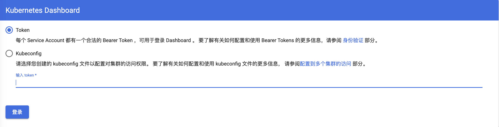
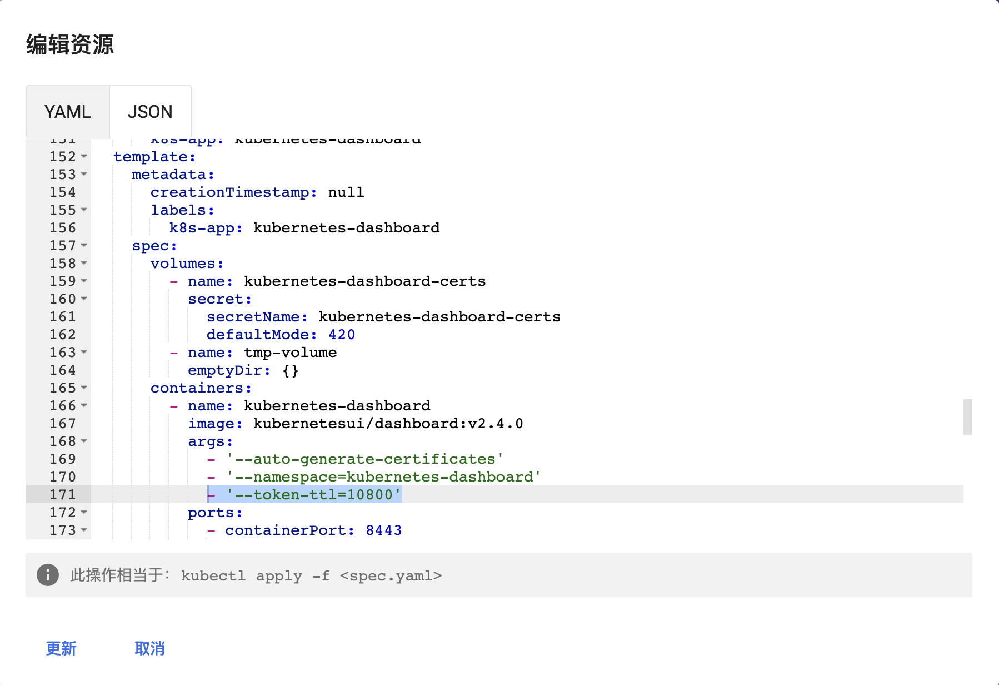

---

#kubernetes #k8s #token #dashboard

---

## 问题现象

kubernetes的dashboard登录token过期时间太短，不操作没一会就需要重新登录



## 解决办法

修改`kubernetes-dashboard`的`deployment`，加入一条`arg`参数：

```
- '--token-ttl=10800'
```


